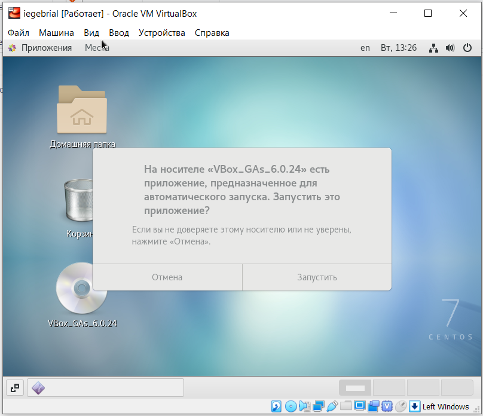
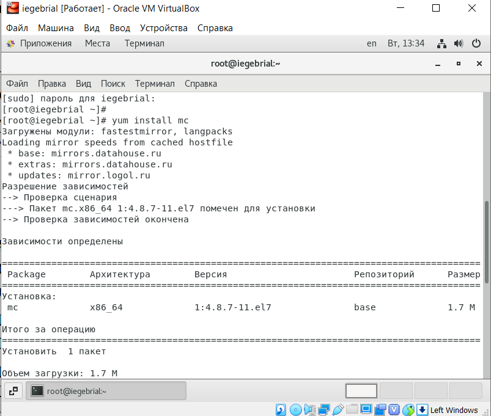

---
## Front matter
lang: ru-RU
title: Установка и конфигурация операционной системы на виртуальную машину
author: |
	Гебриал Ибрам \inst{1}
	
institute: |
	\inst{1}RUDN University, Moscow, Russian Federation
	
date: 2021 Moscow, Russia

## Formatting
toc: false
slide_level: 2
theme: metropolis
header-includes: 
 - \metroset{progressbar=frametitle,sectionpage=progressbar,numbering=fraction}
 - '\makeatletter'
 - '\beamer@ignorenonframefalse'
 - '\makeatother'
aspectratio: 43
section-titles: true
---

# Цель работы

## цель работы

Приобретение практических навыков установки операционной системы на виртуальную машину, настройки минимально необходимых для дальнейшей работы сервисов.

# Задание

## Задание

1. Установить и конфигурировать операционную систему на виртуальную машину.

2. Подключить образ диска Дополнений гостевой OC.

3. Установить mc

# Результаты

## Результаты

Вошёл в систему. (рис. -@fig:001)

.png){ #fig:001 width=70% }

## Результаты

Подключил образ диска Дополнений гостевой OC. (рис. -@fig:002)

{ #fig:002 width=70% }

## Результаты

Установил mc с помощью yum install mc. (рис. -@fig:003)

{ #fig:003 width=70% }

## Вывод

Приобрел практические навыки установки операционной системы на виртуальную машину, также научился настраивать минимально необходимое для дальнейшей работы сервисов.

## {.standout}

Спасибо за внимание 
