---
# Front matter
lang: ru-RU
title: "Отчёт по лабораторной работе 1"
subtitle: "Установка и конфигурация операционной системы на виртуальную машину."
author: "Гебриал Ибрам Есам Зекри НПИ-01-18"

# Formatting
toc-title: "Содержание"
toc: true # Table of contents
toc_depth: 2
lof: true # List of figures
lot: true # List of tables
fontsize: 12pt
linestretch: 1.5
papersize: a4paper
documentclass: scrreprt
polyglossia-lang: russian
polyglossia-otherlangs: english
mainfont: PT Serif
romanfont: PT Serif
sansfont: PT Sans
monofont: PT Mono
mainfontoptions: Ligatures=TeX
romanfontoptions: Ligatures=TeX
sansfontoptions: Ligatures=TeX,Scale=MatchLowercase
monofontoptions: Scale=MatchLowercase
indent: true
pdf-engine: lualatex
header-includes:
  - \linepenalty=10 # the penalty added to the badness of each line within a paragraph (no associated penalty node) Increasing the value makes tex try to have fewer lines in the paragraph.
  - \interlinepenalty=0 # value of the penalty (node) added after each line of a paragraph.
  - \hyphenpenalty=50 # the penalty for line breaking at an automatically inserted hyphen
  - \exhyphenpenalty=50 # the penalty for line breaking at an explicit hyphen
  - \binoppenalty=700 # the penalty for breaking a line at a binary operator
  - \relpenalty=500 # the penalty for breaking a line at a relation
  - \clubpenalty=150 # extra penalty for breaking after first line of a paragraph
  - \widowpenalty=150 # extra penalty for breaking before last line of a paragraph
  - \displaywidowpenalty=50 # extra penalty for breaking before last line before a display math
  - \brokenpenalty=100 # extra penalty for page breaking after a hyphenated line
  - \predisplaypenalty=10000 # penalty for breaking before a display
  - \postdisplaypenalty=0 # penalty for breaking after a display
  - \floatingpenalty = 20000 # penalty for splitting an insertion (can only be split footnote in standard LaTeX)
  - \raggedbottom # or \flushbottom
  - \usepackage{float} # keep figures where there are in the text
  - \floatplacement{figure}{H} # keep figures where there are in the text
---

# Цель работы

Приобретение практических навыков установки операционной системы на виртуальную машину, настройки минимально необходимых для дальнейшей работы сервисов.

# Задание

1. Установить и конфигурировать операционную систему на виртуальную машину.

2. Подключить образ диска Дополнений гостевой OC.

3. Установить mc

# Теоретические сведения

VirtualBox (Oracle VM VirtualBox) — программный продукт виртуализации для операционных систем Microsoft Windows, Linux, FreeBSD, macOS, Solaris/OpenSolaris, ReactOS, DOS и других.

CentOS — дистрибутив Linux. Дистрибутив операционной системы — это форма распространения системного программного обеспечения. ЦентОС основан на коммерческом дистрибутиве Линукс — Red Hat Enterprise Linux (RHEL), который предназначен для корпоративного использования и имеет коммерческую поддержку на протяжении десяти лет.

**Для чего нужна CentOS**

CentOS — это серверная операционная система с открытым исходным кодом. Не является коммерческой и предоставляется бесплатно для конечных пользователей. Ориентируется на бизнес и корпоративных клиентов. Используется на услугах виртуального выделенного сервера и выделенного сервера.

**CentOS 7: что это**

CentOS 7 — это седьмая версия операционной системы ЦентОС, выпущенная в две тысячи четырнадцатом году.

Описание и особенности системы:

- Дата релиза — седьмого июля 2014 года.

- Полная поддержка запланирована до четвертого квартала 2020 года.

- Критические обновления — до 30 июня 2024.

- Разработана на ядре Линукс версии 3.10.

- Включает HTTP-сервер Apache версии 2.4

- Улучшенная асинхронная обработка запросов.

# Выполнение лабораторной работы

Перешёл в каталог /var/tmp и создал каталог с именем пользователя iegebrial. (рис. -@fig:001)

.png){ #fig:001 width=70% }

Скопировал образ, CentOS-7-x86_64-DVD-2009 виртуальной машины в своем каталоге: (рис. -@fig:002)

.png){ #fig:002 width=70% }

Запустил виртуальную машину. (рис. -@fig:003)

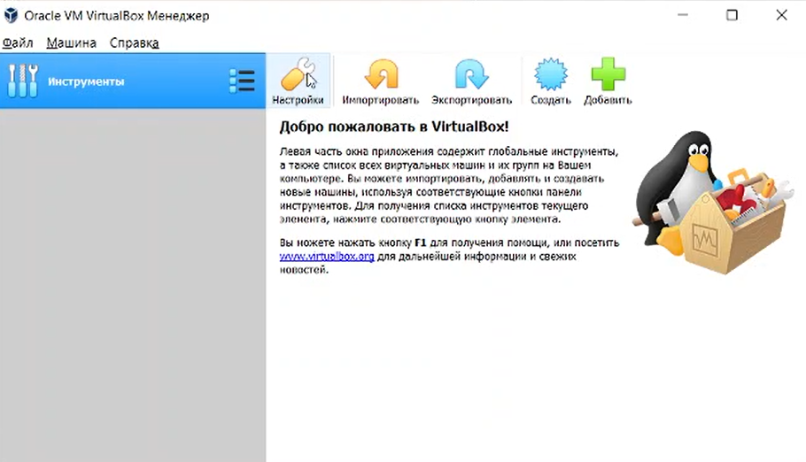{ #fig:003 width=70% }

Проверить в свойствах VirtualBox месторасположение каталога для виртуальных машин. Для этого в VirtualBox выбрал Файл Свойства, вкладка Общие . В поле Папка для машин было указано другой каталог. Изменил его на /var/tmp/iegebrial (рис. -@fig:004)

{ #fig:004 width=70% }

Создал новую виртуальную машину. Для этого в VirtualBox выбрал Машина Создать. Указал имя виртуальной машины — iegebrial, тип операционной системы — Linux, RedHat. (рис. -@fig:005)

.png){ #fig:005 width=70% }

Указал размер основной памяти виртуальной машины — 1024 МБ. (рис. -@fig:006)

.png){ #fig:006 width=70% }

Задал конфигурацию жёсткого диска — загрузочный (рис. -@fig:007) 

.png){ #fig:007 width=70% }

VDI (BirtualBox Disk Image) (рис. -@fig:008) 

.png){ #fig:008 width=70% }

Динамический виртуальный диск.(рис. -@fig:009) 

.png){ #fig:009 width=70% }

Задать размер диска — 40 ГБ, его расположение — в данном случае /var/tmp/iegebrial/iegebrial/iegebrial.vdi (рис. -@fig:010) 

.png){ #fig:010 width=70% }

Выделил в окне менеджера VirtualBox виртуальную машину Base, и открыл окно Свойства . Проверил, что папка для снимков виртуальной машины iegebrial имеет путь /var/tmp/iegebrial/iegebrial/Snapshots (рис. -@fig:011) 

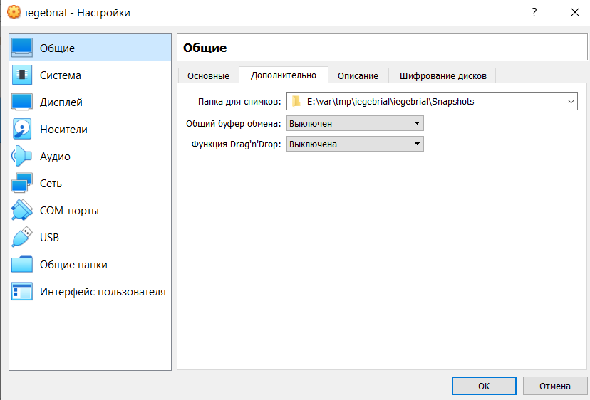{ #fig:011 width=70% }

Выбрал в VirtualBox Свойства Носители виртуальной машины Base. Добавил новый привод оптических дисков и выбрал образ CentOS-7-x86_64-DVD-2009. (рис. -@fig:012) (рис. -@fig:013)

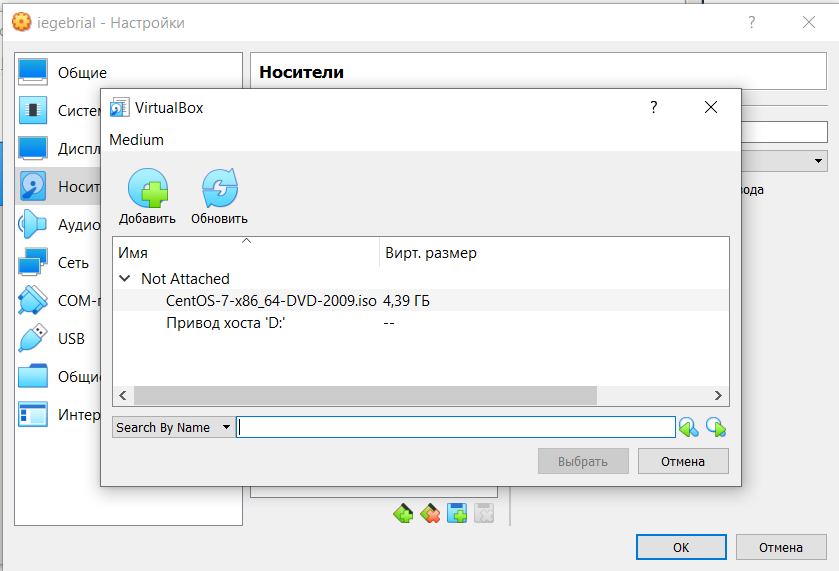{ #fig:012 width=70% }

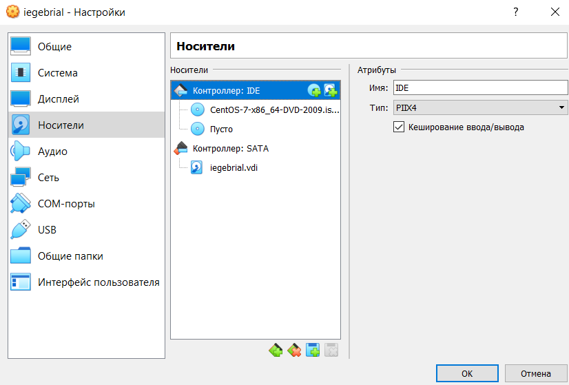{ #fig:013 width=70% }

Запустил виртуальную машину Base, выбрал установку системы на жёсткий диск,установил русский язык для интерфейса и раскладки клавиатуры.(рис. -@fig:014)

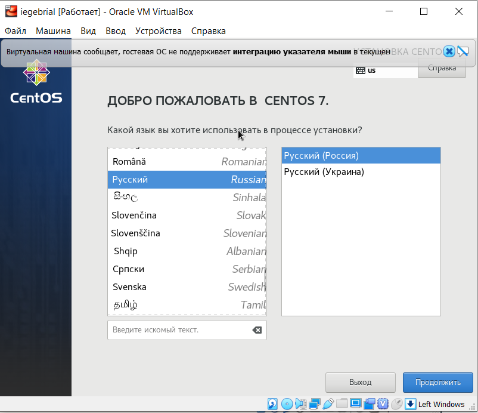{ #fig:014 width=70% }

Указал часовой пояс «Москва» (рис. -@fig:015)

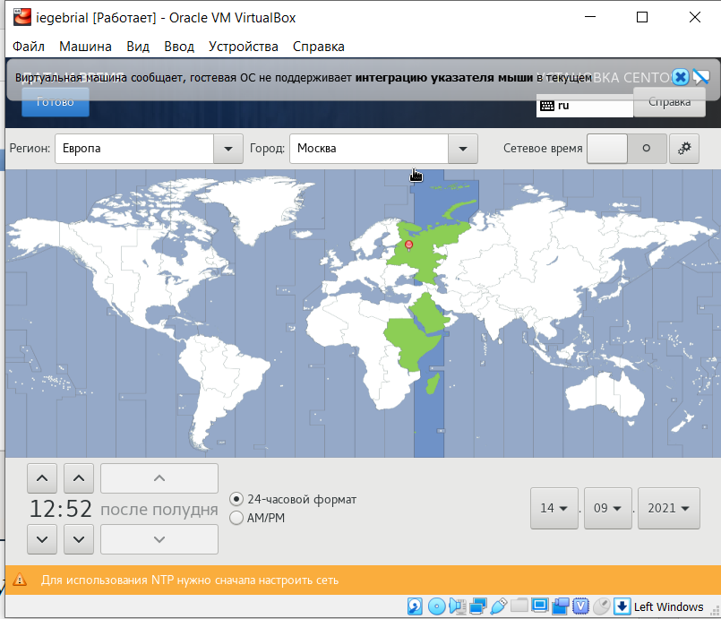{ #fig:015 width=70% }

Выберил раскладку клавиатуры. Определил английский язык как первая раскладка чтобы быть по умолчанию. (рис. -@fig:016)

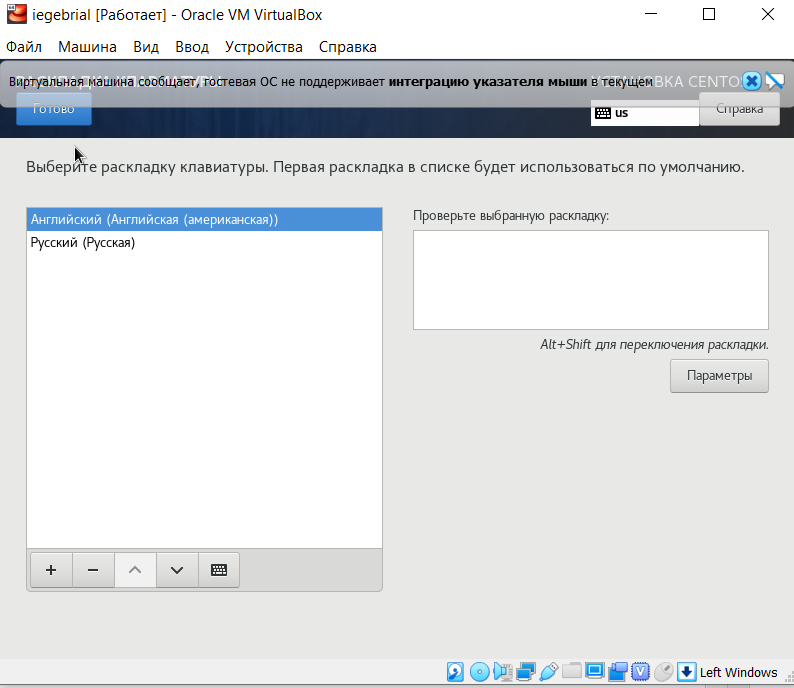{ #fig:016 width=70% }

Выбрал Сервер с GUI и по умолчанию установил Средства разработки. (рис. -@fig:017)

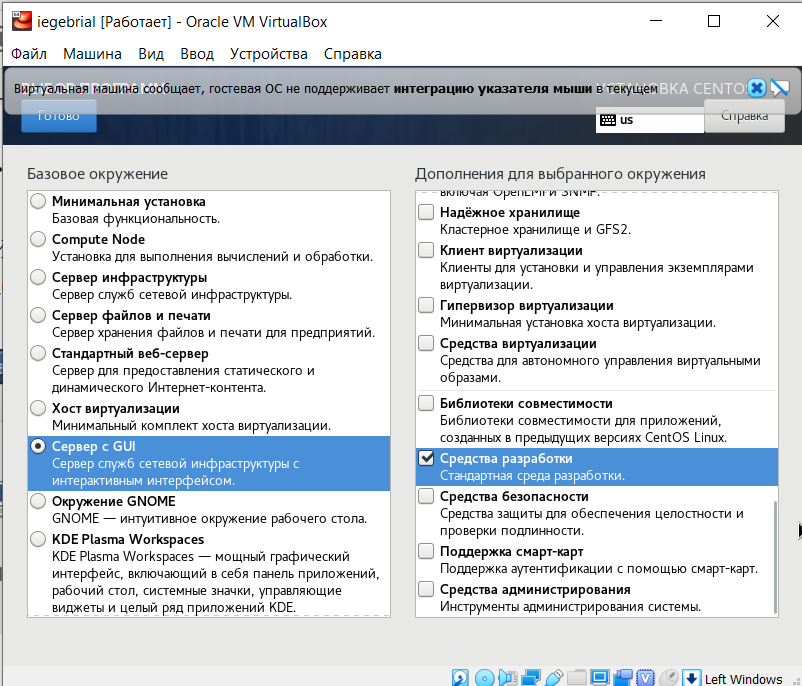{ #fig:017 width=70% }

Смотрел конфигурацию жёсткого диска. (рис. -@fig:018)

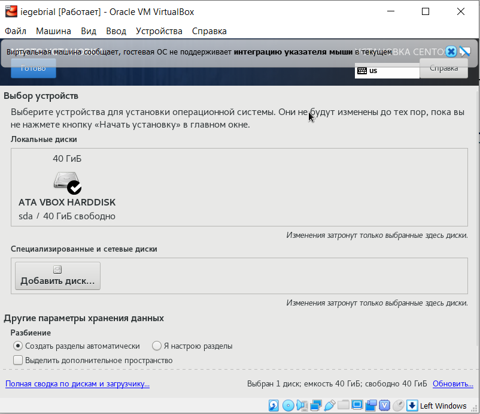{ #fig:018 width=70% }

Отключил kdump. (рис. -@fig:019)

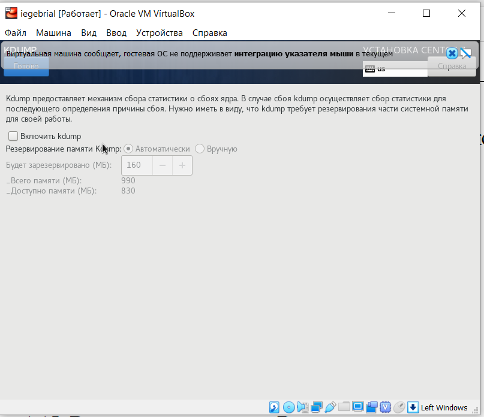{ #fig:019 width=70% }

Включил интернет и в качестве имени машины указать «iegebrial.localdomain» (рис. -@fig:020)

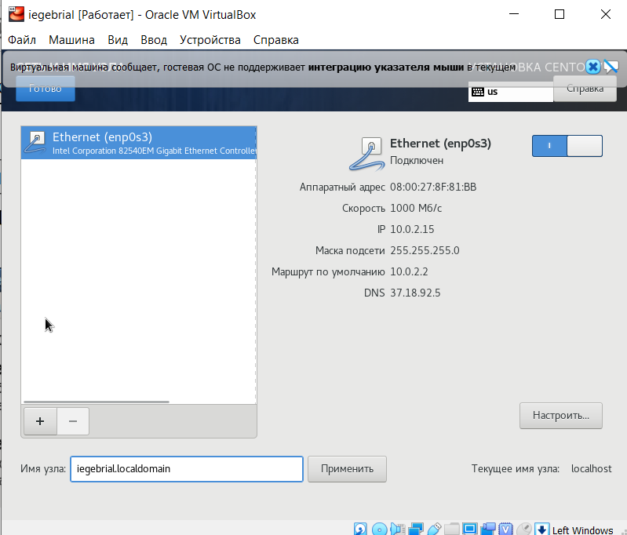{ #fig:020 width=70% }

Установил пароль для root. (рис. -@fig:021)

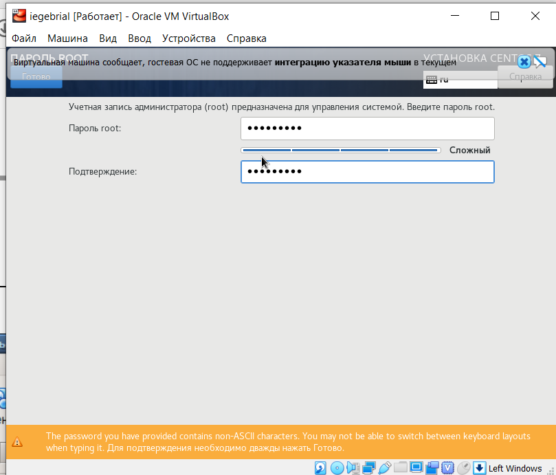{ #fig:021 width=70% }

Создал пользователь. (рис. -@fig:022)

{ #fig:022 width=70% }

Принимал лицензионное соглашение. (рис. -@fig:023)

{ #fig:023 width=70% }

Вошёл в систему. (рис. -@fig:024)

.png){ #fig:024 width=70% }

Подключил образ диска Дополнений гостевой OC. (рис. -@fig:025)

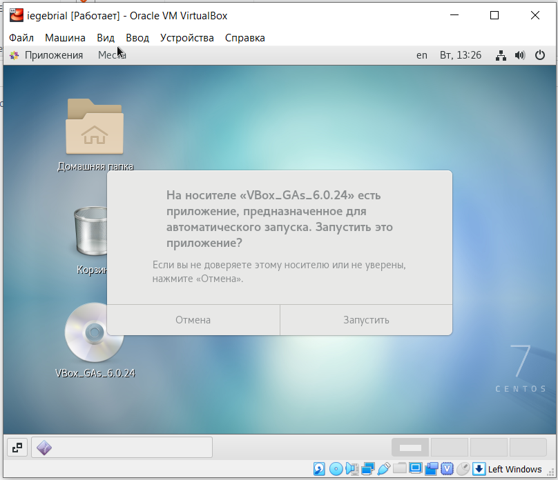{ #fig:025 width=70% }

Установил mc с помощью yum install mc. (рис. -@fig:026)

{ #fig:026 width=70% }

# Выводы

Приобрел практические навыки установки операционной системы на виртуальную машину и настройки минимально необходимых для дальнейшей работы сервисов.

