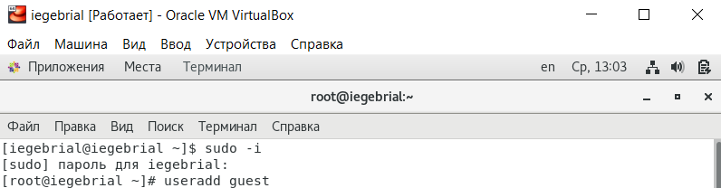

---
# Front matter
lang: ru-RU
title: "Отчёт по лабораторной работе 2"
subtitle: "Дискреционное разграничение прав в Linux. Основные атрибуты."
author: "Гебриал Ибрам Есам Зекри НПИ-01-18"

# Formatting
toc-title: "Содержание"
toc: true # Table of contents
toc_depth: 2
lof: true # List of figures
lot: true # List of tables
fontsize: 12pt
linestretch: 1.5
papersize: a4paper
documentclass: scrreprt
polyglossia-lang: russian
polyglossia-otherlangs: english
mainfont: PT Serif
romanfont: PT Serif
sansfont: PT Sans
monofont: PT Mono
mainfontoptions: Ligatures=TeX
romanfontoptions: Ligatures=TeX
sansfontoptions: Ligatures=TeX,Scale=MatchLowercase
monofontoptions: Scale=MatchLowercase
indent: true
pdf-engine: lualatex
header-includes:
  - \linepenalty=10 # the penalty added to the badness of each line within a paragraph (no associated penalty node) Increasing the value makes tex try to have fewer lines in the paragraph.
  - \interlinepenalty=0 # value of the penalty (node) added after each line of a paragraph.
  - \hyphenpenalty=50 # the penalty for line breaking at an automatically inserted hyphen
  - \exhyphenpenalty=50 # the penalty for line breaking at an explicit hyphen
  - \binoppenalty=700 # the penalty for breaking a line at a binary operator
  - \relpenalty=500 # the penalty for breaking a line at a relation
  - \clubpenalty=150 # extra penalty for breaking after first line of a paragraph
  - \widowpenalty=150 # extra penalty for breaking before last line of a paragraph
  - \displaywidowpenalty=50 # extra penalty for breaking before last line before a display math
  - \brokenpenalty=100 # extra penalty for page breaking after a hyphenated line
  - \predisplaypenalty=10000 # penalty for breaking before a display
  - \postdisplaypenalty=0 # penalty for breaking after a display
  - \floatingpenalty = 20000 # penalty for splitting an insertion (can only be split footnote in standard LaTeX)
  - \raggedbottom # or \flushbottom
  - \usepackage{float} # keep figures where there are in the text
  - \floatplacement{figure}{H} # keep figures where there are in the text
---

# Цель работы

Получение практических навыков работы в консоли с атрибутами файлов, закрепление теоретических основ дискреционного разграничения доступа в современных системах с открытым кодом на базе ОС Linux.

# Задание

1. Создать учётную запись пользователя guest.

2. Получить практические навыки работы с атрибутами файлов.

3. Закрепить теоретические основы дискреционного разграничения доступа.

# Теоретические сведения

Атрибуты файлов в Linux - это набор из девяти основных битов. Определяющих какие из пользователей обладают правами на чтение, запись. А также запуск файлов для выполнения. Данный набор формирует код, называемый режимом доступа к файлу/каталогу. Первые три бита определяют права доступа для владельца. Следующие — для группы пользователей, к которой относится файл. и последние три бита — права доступа для всех остальных пользователей в системе.

**Как это работает?**

Для записи кода режима доступа используется восьмеричная запись чисел. Как уже было отмечено, код доступа содержит три «триады» битов — для пользователя, группы и всех остальных, именно в таком порядке. Битам из первой триады соответствуют значения в восьмеричной записи 400, 200 и 100. Для второй триады (т. е. для группы) — 40, 20 и 10. Наконец, для третьей (все остальные) — 4, 2 и 1. В свою очередь, первому биту в каждой триаде соответствует доступ на чтение (r — «read»). Второму — на запись (w — «write») и третьему — на выполнение, т. е. x — «execute».

В традиционной модели прав доступа UNIX предполагается, что каждый пользователь «заперт» в пределах всего одной категории (триады). Это означает, что для неоднозначной ситуации применяются самые строгие права. Например, право на владение всегда определяется только битами из триады владельца. И никак и никогда группой или другими пользователями.

Установка бита чтения (r) в одной из триад (или во всех) задаёт право открывать данный файл для чтения соответствующим категориям пользователей. Наличие бита записи (w) позволяет изменять файл. При этом возможно его удаление и/или переименование файла, но только в том случае, если заданы соответствующие биты для его родительского каталога, поскольку именно в его записях хранятся имена файлов.

**Команда chmod:**

Как и следует из ее имени, команда chmod предназначена для смены атрибутов доступа - чтения, изменения и исполнения. В отношении единичного файла делается это просто:

chmod [атрибуты] filename

Атрибуты доступа могу устанавливаться с использование как символьной, так и цифровой нотации (подробнее об этом будет говориться в Intro-цикле). Первый способ - указание, для каких атрибутов принадлежности (хозяина, группы и всех остальных) какие атрибуты доступа задействованы. Атрибуты принадлежности обозначаются символами u (от user) для хозяина файла, g (от group) - для группы, o (от other) для прочих и a (от all) - для всех категорий принадлежности вообще. Атрибуты доступа символизируются литерами r (от read), дающей право чтения, w (от write) - право изменения и x (от execute) - право исполнения.

Атрибуты принадлежности соединяются с атрибутами доступа символами + (присвоение атрибута доступа), - (отъятие атрибута) или = (присвоение только данного атрибута доступа с одновременным отъятием всех остальных). Одновременно в строке можно указать (подряд, без пробелов) более чем один из атрибутов принадлежности и несколько (или все) атрибуты доступа.

Для пояснения сказанного приведу несколько примеров. Так, команда

chmod u+w filename

установит для хозяина (u - от user) право изменения (w - от write) файла filename, а команда

chmod a-x filename

отнимет у всех пользователей вообще право его исполнения. В случае, если некоторый атрибут доступа присваивается всем категориям принадлежности, символ a можно опустить. Так, команда

chmod +x filename

в противоположность предыдущей, присвоит атрибут исполнения файла filename всем категориям принадлежности (и хозяину, и группе, и прочим).

С помощью команды

chmod go=rx filename

можно присвоить группе принадлежности файла filename и всем прочим (не хозяину и не группе) право на его чтение и исполнение с одновременным отнятием права изменения.

Наконец, команда chmod в состоянии установить и дополнительные атрибуты доступа к файлу, такие, как биты SUID и GUID, или, скажем, атрибут sticky (и о них будет разговор в Intro-цикле). Так, в некоторых системах (например, во FreeBSD - в Linux-дистрибутивах я с таким не встречался) XFree86 по умолчанию устанавливается без атрибута суидности на исполнимом файле X-сервера. Это влечет за собой невозможность (без специальных wrapper'ов) запуска Иксов от лица обычного пользователя. Один из способов борьбы - просто присвоить этому файлу бит суидности:

chmod u+s /usr/X11R6/bin/XFree86

Приведенные примеры можно многократно умножить, но, думается, их достаточно для понимания принципов работы команды chmod с символьной нотацией атрибутов.

Цифровая нотация - еще проще. При ней достаточно указать сумму присваиваемых атрибутов в восьмеричном исчислении (4 - атрибут чтения, 2 - атрибут изменения и 1 - атрибут исполнения; 0 символизирует отсутствие любых атрибутов доступа) для хозяина (первая позиция), группы (вторая позиция) и прочих (третья позиция). Все атрибуты доступа, оставшиеся вне этой суммы, автоматически отнимаются у данного файла. То есть команда

chmod 000 filename

означает снятие с файла filename всех атрибутов доступа для всех категорий принадлежности (в том числе и хозяина) и эквивалентна команде

chmod =rwx filename

в символьной нотации. А команда

chmod 777 filename

напротив, устанавливает для всех полный доступ к файлу filename. Для установки дополнительных атрибутов доступа в численной нотации потребуется указать значение четвертого, старшего, регистра. Так, команда для рассмотренного выше примера - присвоения атрибута суидности исполнимому файлу X-сервера, - в численной нотации будет выглядеть как

chmod 4711 /usr/X11R6/bin/XFree86

Как и для команд chown и chgrp, наиболее значимые опции команды chmod --reference и -R. И смысл их - идентичен. Первая устанавливает для файла (файлов) атрибуты доступа, идентичные таковым референсного файла, вторая - распространяет действие команды на все вложенные подкаталоги и входящие в них файлы.

Рекурсивное присвоение атрибутов доступа по образцу требует внимания. Так, если рекурсивно отнять для всего содержимого домашнего каталога атрибут исполнения (а он без соблюдения некоторых условий монтирования автоматом присваивается любым файлам, скопированным с носителей файловой структуры FAT или ISO9660 без расширения RockRidge, что подчас мешает), то тем самым станет невозможным вход в любой из вложенных подкаталогов. Впрочем, в разделе про утилиту find будет показан один из способов борьбы с таким безобразием.

# Выполнение лабораторной работы

1. Создал учётную запись пользователя guest (использую учётную запись администратора): (рис. -@fig:001)

С помощью команды: 

useradd guest

{ #fig:001 width=70% }

2. Задал пароль для пользователя guest: (рис. -@fig:002)

С помощью команды: 

passwd guest

{ #fig:002 width=70% }

3. Вошёл в систему от имени пользователя guest. (рис. -@fig:003)

{ #fig:003 width=70% }

4.Определил директорию, в которой я нахожусь, командой pwd. она является своей домашней директорией.(рис. -@fig:004)

{ #fig:004 width=70% }

5.Уточнил имя своего пользователя командой whoami.(рис. -@fig:005)

{ #fig:005 width=70% }

6. Уточнил имя вашего пользователя, его группу, а также группы, куда входит пользователь, командой id. Выведенные значения uid, gid и др. 
запомните. Сравнил вывод id с выводом команды groups.(рис. -@fig:006)

Команда id покажет идентификатор пользователя ( uid ), основную группу пользователя ( gid ) и вторичные группы ( groups ) пользователя.

А команда groups распечатает список всех групп, к которым принадлежит текущий зарегистрированный пользователь.

{ #fig:006 width=70% }

7. Имя пользователя совпабадет с именем пользователя в приглашении командной строки.

8. Просмотрел файл /etc/passwd командой cat /etc/passwd. (рис. -@fig:007)

Значения uid и gid пользователя совпадают с их значениями в предыдущих пунктах.

{ #fig:007 width=70% }

9. Определил существующие в системе директории командой ls -l /home/ (рис. -@fig:008)

Нет не удалось мне получить список поддиректорий директории /home. На директориях установлены следующие права: r-права на чтение, w-права на запись, x-права на исполнение.

{ #fig:008 width=70% }

10. Проверил какие расширенные атрибуты установлены на поддиректориях, находящихся в директории /home, командой: lsattr /home (рис. -@fig:009)

Расширенные атрибуты для guest не установлены. Не удалось мне увидеть расширенные атрибуты директорий других пользователей.

{ #fig:009 width=70% }

11. Создал в домашней директории поддиректорию dir1 командой mkdir dir1 и определил командами ls -l (рис. -@fig:010)

На директорию dirl установлены следующие права: r-права на чтение, w-права на запись, x-права на исполнение для владельца и для основной группы
пользователей, а для остальных только чтение и исполнение без права записи.

расширенные атрибуты директории dir1 lsattr. (рис. -@fig:011)

{ #fig:010 width=70% }

{ #fig:011 width=70% }

12. Снимил с директории dir1 все атрибуты командой
chmod 000 dir1

и проверил с её помощью правильность выполнения команды
ls -l (рис. -@fig:012)

{ #fig:012 width=70% }

13. Попытался создать в директории dir1 файл file1 командой
echo "test" > /home/guest/dir1/file1 (рис. -@fig:013)

{ #fig:013 width=70% }

Не получилось создать файл в директории dir1 потому что нет прав доступа к директории dir1.

не смогу смотреть ls -l /home/guest/dir1 так как отключил все права доступа на директорию. (рис. -@fig:014)

{ #fig:014 width=70% }

Вернул права доступа пользователю и проверил командой ls -l /home/guest/dir1(рис. -@fig:015)

file1 не находится внутри директории dir1.

{ #fig:015 width=70% }

14. Заполнил таблицу «Установленные права и разрешённые действия»
(см. табл. [-@tbl:001]), выполняя действия от имени владельца директории (файлов), определив опытным путём, какие операции разрешены, а какие нет.
Если операция разрешена, занесил в таблицу знак «+», если не разрешена, знак «-».

: Установленные права и разрешённые действия {#tbl:001}

| Права директории | Права файла | Создание файла | Удаление файла | Запись в файл | Чтение файла | Смена директории | Просмотр файлов в директории | Переименование файла | Смена атрибутов файла |
|------------------|-------------|----------------|----------------|---------------|--------------|------------------|------------------------------|----------------------|-----------------------|
| d--- (000)        | --- (000)   | -              | -              | -             | -            | -                | -                            | -                    | -                     |
| d--- (000)        | --x (100)   | -              | -              | -             | -            | -                | -                            | -                    | -                     |
| d--- (000)        | -w- (200)   | -              | -              | -             | -            | -                | -                            | -                    | -                     |
| d--- (000)        | -wx (300)   | -              | -              | -             | -            | -                | -                            | -                    | -                     |
| d--- (000)        | r-- (400)   | -              | -              | -             | -            | -                | -                            | -                    | -                     |
| d--- (000)        | r-x (500)   | -              | -              | -             | -            | -                | -                            | -                    | -                     |
| d--- (000)        | rw- (600)   | -              | -              | -             | -            | -                | -                            | -                    | -                     |
| d--- (000)        | rwx (700)   | -              | -              | -             | -            | -                | -                            | -                    | -                     |
| d--x (100)        | --- (000)   | -              | -              | -             | -            | +                | -                            | -                    | +                     |
| d--x (100)        | --x (100)   | -              | -              | -             | -            | +                | -                            | -                    | +                     |
| d--x (100)        | -w- (200)   | -              | -              | +             | -            | +                | -                            | -                    | +                     |
| d--x (100)        | -wx (300)   | -              | -              | +             | -            | +                | -                            | -                    | +                     |
| d--x (100)        | r-- (400)   | -              | -              | -             | +            | +                | -                            | -                    | +                     |
| d--x (100)        | r-x (500)   | -              | -              | -             | +            | +                | -                            | -                    | +                     |
| d--x (100)        | rw- (600)   | -              | -              | +             | +            | +                | -                            | -                    | +                     |
| d--x (100)        | rwx (700)   | -              | -              | +             | +            | +                | -                            | -                    | +                     |
| d-w- (200)        | --- (000)   | -              | -              | -             | -            | -                | -                            | -                    | -                     |
| d-w- (200)        | --x (100)   | -              | -              | -             | -            | -                | -                            | -                    | -                     |
| d-w- (200)        | -w- (200)   | -              | -              | -             | -            | -                | -                            | -                    | -                     |
| d-w- (200)        | -wx (300)   | -              | -              | -             | -            | -                | -                            | -                    | -                     |
| d-w- (200)        | r-- (400)   | -              | -              | -             | -            | -                | -                            | -                    | -                     |
| d-w- (200)        | r-x (500)   | -              | -              | -             | -            | -                | -                            | -                    | -                     |
| d-w- (200)        | rw- (600)   | -              | -              | -             | -            | -                | -                            | -                    | -                     |
| d-w- (200)        | rwx (700)   | -              | -              | -             | -            | -                | -                            | -                    | -                     |
| d-wx (300)        | --- (000)   | +              | +              | -             | -            | +                | -                            | +                    | +                     |
| d-wx (300)        | --x (100)   | +              | +              | -             | -            | +                | -                            | +                    | +                     |
| d-wx (300)        | -w- (200)   | +              | +              | +             | -            | +                | -                            | +                    | +                     |
| d-wx (300)        | -wx (300)   | +              | +              | +             | -            | +                | -                            | +                    | +                     |
| d-wx (300)        | r-- (400)   | +              | +              | -             | +            | +                | -                            | +                    | +                     |
| d-wx (300)        | r-x (500)   | +              | +              | -             | +            | +                | -                            | +                    | +                     |
| d-wx (300)        | rw- (600)   | +              | +              | +             | +            | +                | -                            | +                    | +                     |
| d-wx (300)        | rwx (700)   | +              | +              | +             | +            | +                | -                            | +                    | +                     |
| dr-- (400)        | --- (000)   | -              | -              | -             | -            | -                | +                            | -                    | -                     |
| dr-- (400)        | --x (100)   | -              | -              | -             | -            | -                | +                            | -                    | -                     |
| dr-- (400)        | -w- (200)   | -              | -              | -             | -            | -                | +                            | -                    | -                     |
| dr-- (400)        | -wx (300)   | -              | -              | -             | -            | -                | +                            | -                    | -                     |
| dr-- (400)        | r-- (400)   | -              | -              | -             | -            | -                | +                            | -                    | -                     |
| dr-- (400)        | r-x (500)   | -              | -              | -             | -            | -                | +                            | -                    | -                     |
| dr-- (400)        | rw- (600)   | -              | -              | -             | -            | -                | +                            | -                    | -                     |
| dr-- (400)        | rwx (700)   | -              | -              | -             | -            | -                | +                            | -                    | -                     |
| dr-x (500)        | --- (000)   | -              | -              | -             | -            | +                | +                            | -                    | +                     |
| dr-x (500)        | --x (100)   | -              | -              | -             | -            | +                | +                            | -                    | +                     |
| dr-x (500)        | -w- (200)   | -              | -              | +             | -            | +                | +                            | -                    | +                     |
| dr-x (500)        | -wx (300)   | -              | -              | +             | -            | +                | +                            | -                    | +                     |
| dr-x (500)        | r-- (400)   | -              | -              | -             | +            | +                | +                            | -                    | +                     |
| dr-x (500)        | r-x (500)   | -              | -              | -             | +            | +                | +                            | -                    | +                     |
| dr-x (500)        | rw- (600)   | -              | -              | +             | +            | +                | +                            | -                    | +                     |
| dr-x (500)        | rwx (700)   | -              | -              | +             | +            | +                | +                            | -                    | +                     |
| drw- (600)        | --- (000)   | -              | -              | -             | -            | -                | +                            | -                    | -                     |
| drw- (600)        | --x (100)   | -              | -              | -             | -            | -                | +                            | -                    | -                     |
| drw- (600)        | -w- (200)   | -              | -              | -             | -            | -                | +                            | -                    | -                     |
| drw- (600)        | -wx (300)   | -              | -              | -             | -            | -                | +                            | -                    | -                     |
| drw- (600)        | r-- (400)   | -              | -              | -             | -            | -                | +                            | -                    | -                     |
| drw- (600)        | r-x (500)   | -              | -              | -             | -            | -                | +                            | -                    | -                     |
| drw- (600)        | rw- (600)   | -              | -              | -             | -            | -                | +                            | -                    | -                     |
| drw- (600)        | rwx (700)   | -              | -              | -             | -            | -                | +                            | -                    | -                     |
| drwx (700)        | --- (000)   | +              | +              | -             | -            | +                | +                            | +                    | +                     |
| drwx (700)        | --x (100)   | +              | +              | -             | -            | +                | +                            | +                    | +                     |
| drwx (700)        | -w- (200)   | +              | +              | +             | -            | +                | +                            | +                    | +                     |
| drwx (700)        | -wx (300)   | +              | +              | +             | -            | +                | +                            | +                    | +                     |
| drwx (700)        | r-- (400)   | +              | +              | -             | +            | +                | +                            | +                    | +                     |
| drwx (700)        | r-x (500)   | +              | +              | -             | +            | +                | +                            | +                    | +                     |
| drwx (700)        | rw- (600)   | +              | +              | +             | +            | +                | +                            | +                    | +                     |
| drwx (700)        | rwx (700)   | +              | +              | +             | +            | +  

15. На основании заполненной таблицы определил те или иные минимально необходимые права для выполнения операций внутри директории dir1, заполните (см. табл. [-@tbl:001]).

: Минимальные права для совершения операций {#tbl:002}

| Операция               | Мин права на директорию | Мин права на файл |
|------------------------|---------------------------------|---------------------------|
| Создание файла         | -wx (300)                       | --- (000)                 |
| Удаление файла         | -wx (300)                       | --- (000)                 |
| Чтение файла           | --x (100)                       | r-- (400)                 |
| Запись в файл          | --x (100)                       | -w- (200)                 |
| Переименование файла   | -wx (300)                       | --- (000)                 |
| Создание поддиректории | -wx (300)                       | --- (000)                 |
| Удаление поддиректории | -wx (300)                       | --- (000)                 |

# Выводы

Получил практические навыки работы в консоли с атрибутами файлов, закрепил теоретические основы дискреционного разграничения доступа в современных системах с открытым кодом на базе ОС Linux.

