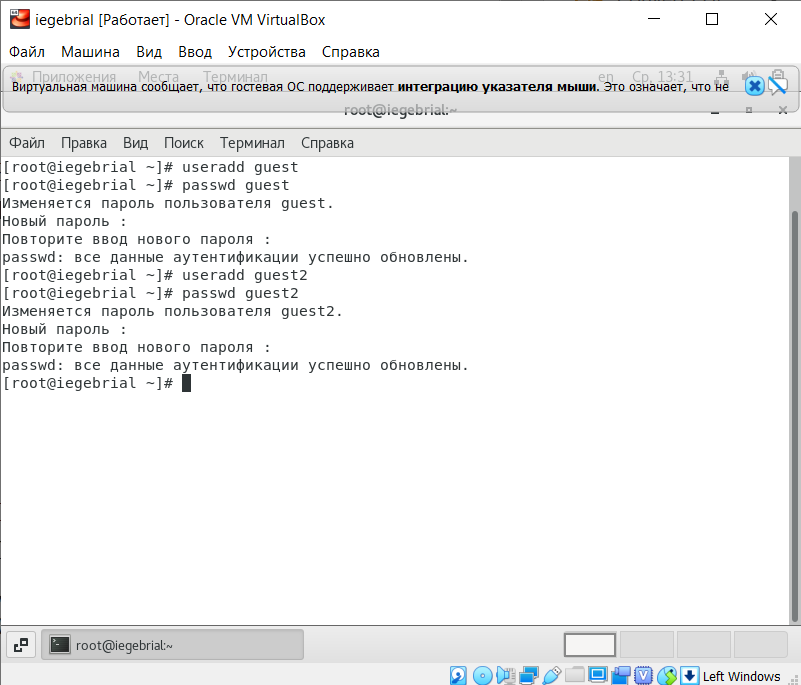
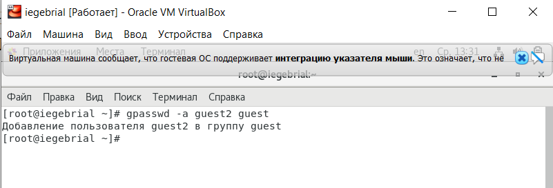
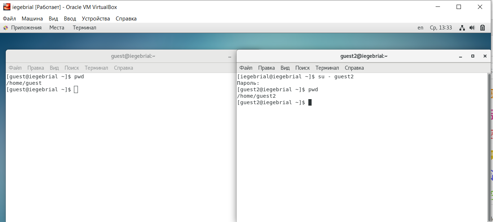
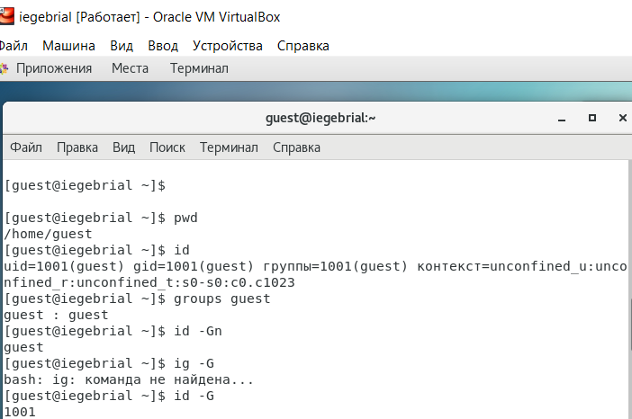
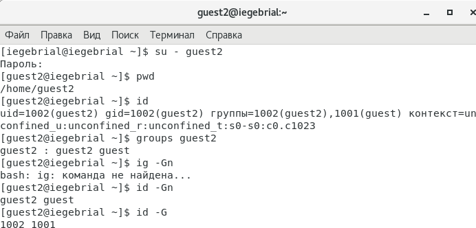

---
## Front matter
lang: ru-RU
title: Дискреционное разграничение прав в Linux. Два пользователя.
author: |
	Гебриал Ибрам \inst{1}
	
institute: |
	\inst{1}RUDN University, Moscow, Russian Federation
	
date: 2021 Moscow, Russia

## Formatting
toc: false
slide_level: 2
theme: metropolis
header-includes: 
 - \metroset{progressbar=frametitle,sectionpage=progressbar,numbering=fraction}
 - '\makeatletter'
 - '\beamer@ignorenonframefalse'
 - '\makeatother'
aspectratio: 43
section-titles: true
---

# Цель работы

## Цель работы

Получение практических навыков работы в консоли с атрибутами файлов для групп пользователей.

# Задание

## Задание

1. Создать учётную запись пользователя guest и guest2.

2. Получить практические навыки работы с атрибутами файлов для групп пользователей.

# Результаты

## Результаты

Создал учётную запись пользователя guest и guest2 и задал пароль для этих пользователеи (рис. -@fig:001)

{ #fig:001 width=50% }

## Результаты

2. Добавил пользователь guest2 в группу guest: (рис. -@fig:002)

{ #fig:002 width=70% }

## Результаты

3. Для обоих пользователей командой pwd определил директорию, в которой находился.(рис. -@fig:003)

{ #fig:003 width=70% }

## Результаты

Уточнил имя моего пользователя, его группу, кто входит в неё
и к каким группам принадлежит он сам. Определил командами groups guest и groups guest2, в какие группы входят пользователи guest и guest2. (рис. -@fig:004)(рис. -@fig:005)

{ #fig:004 width=70% }

## Результаты

{ #fig:005 width=70% }

## Результаты

Заполнил таблицу «Установленные права и разрешённые действия» (рис. -@fig:006) 

.png){ #fig:006 width=70% }

## Результаты

Минимальные права для совершения операция (рис. -@fig:007) 

.png){ #fig:007 width=70% }

## Вывод

Получил практические навыки работы в консоли с атрибутами файлов для групп пользователей.

## {.standout}

Спасибо за внимание 
