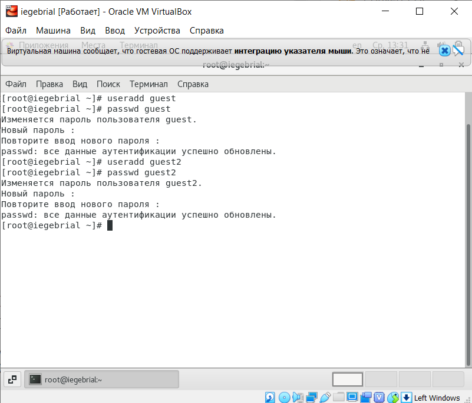
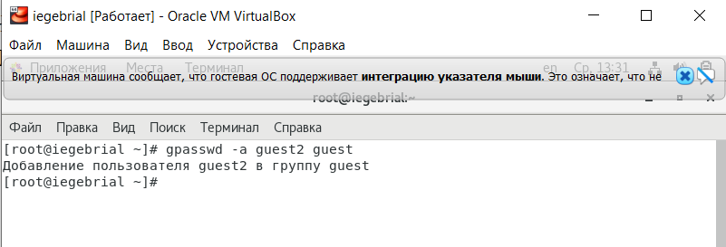
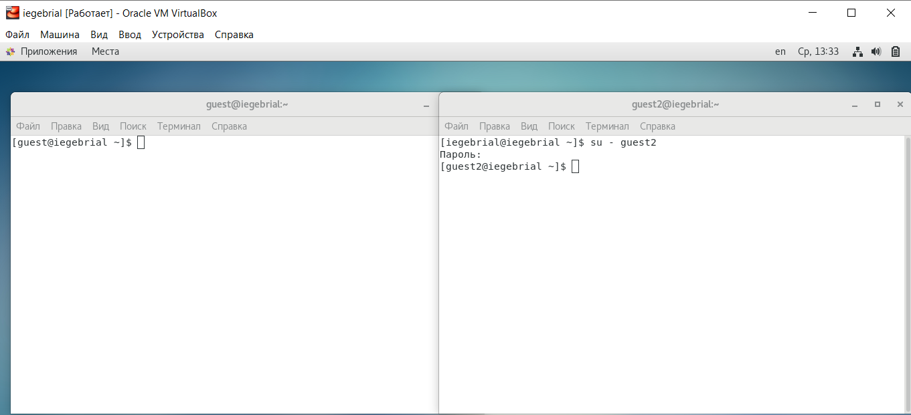
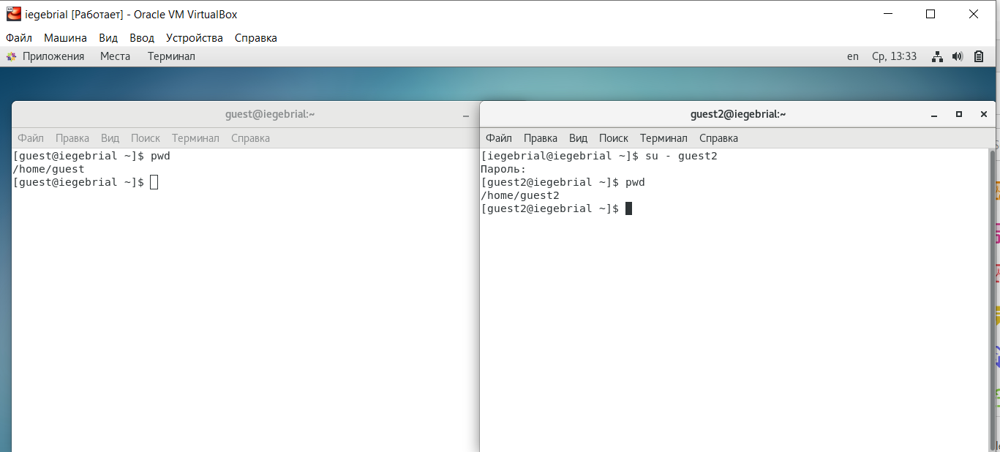
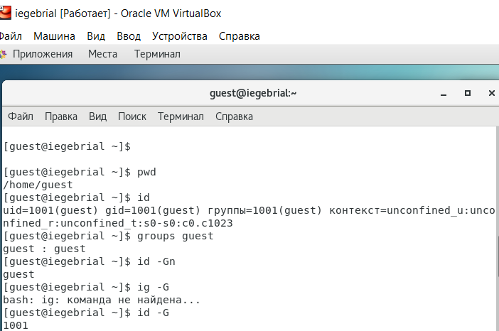
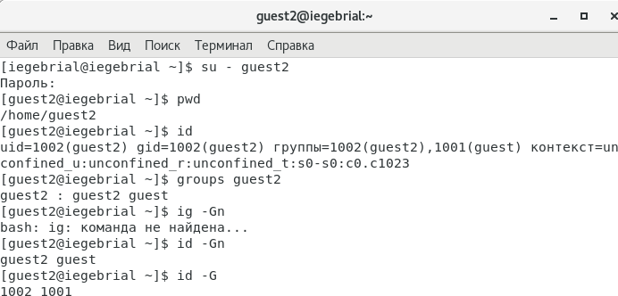
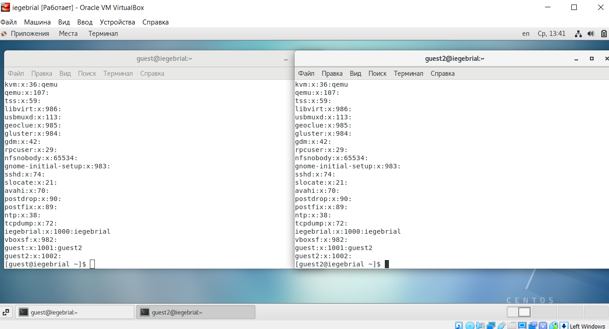
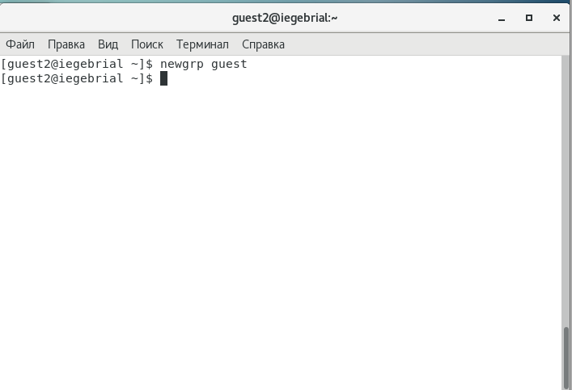
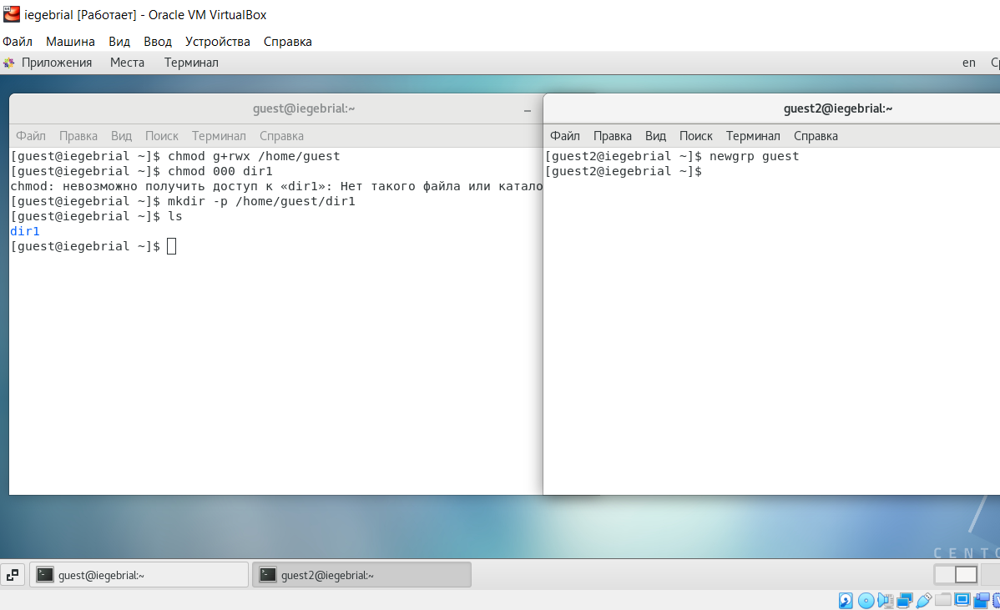

---
# Front matter
lang: ru-RU
title: "Отчёт по лабораторной работе 3"
subtitle: "Дискреционное разграничение прав в Linux. Два пользователя."
author: "Гебриал Ибрам Есам Зекри НПИ-01-18"

# Formatting
toc-title: "Содержание"
toc: true # Table of contents
toc_depth: 2
lof: true # List of figures
lot: true # List of tables
fontsize: 12pt
linestretch: 1.5
papersize: a4paper
documentclass: scrreprt
polyglossia-lang: russian
polyglossia-otherlangs: english
mainfont: PT Serif
romanfont: PT Serif
sansfont: PT Sans
monofont: PT Mono
mainfontoptions: Ligatures=TeX
romanfontoptions: Ligatures=TeX
sansfontoptions: Ligatures=TeX,Scale=MatchLowercase
monofontoptions: Scale=MatchLowercase
indent: true
pdf-engine: lualatex
header-includes:
  - \linepenalty=10 # the penalty added to the badness of each line within a paragraph (no associated penalty node) Increasing the value makes tex try to have fewer lines in the paragraph.
  - \interlinepenalty=0 # value of the penalty (node) added after each line of a paragraph.
  - \hyphenpenalty=50 # the penalty for line breaking at an automatically inserted hyphen
  - \exhyphenpenalty=50 # the penalty for line breaking at an explicit hyphen
  - \binoppenalty=700 # the penalty for breaking a line at a binary operator
  - \relpenalty=500 # the penalty for breaking a line at a relation
  - \clubpenalty=150 # extra penalty for breaking after first line of a paragraph
  - \widowpenalty=150 # extra penalty for breaking before last line of a paragraph
  - \displaywidowpenalty=50 # extra penalty for breaking before last line before a display math
  - \brokenpenalty=100 # extra penalty for page breaking after a hyphenated line
  - \predisplaypenalty=10000 # penalty for breaking before a display
  - \postdisplaypenalty=0 # penalty for breaking after a display
  - \floatingpenalty = 20000 # penalty for splitting an insertion (can only be split footnote in standard LaTeX)
  - \raggedbottom # or \flushbottom
  - \usepackage{float} # keep figures where there are in the text
  - \floatplacement{figure}{H} # keep figures where there are in the text
---

# Цель работы

Получение практических навыков работы в консоли с атрибутами файлов для групп пользователей.

# Задание

1. Создать учётную запись пользователя guest и guest2.

2. Получить практические навыки работы с атрибутами файлов для групп пользователей.

# Теоретические сведения

Поскольку система Linux с самого начала разрабатывалась как многопользовательская система, в ней предусмотрен такой механизм, как права доступа к файлам и каталогам. Он позволяет разграничить полномочия пользователей, работающих в системе. В частности, права доступа позволяют отдельным пользователям иметь «личные» файлы и каталоги. Например, если пользователь iegebrial создал в своём домашнем каталоге файлы, то он является владельцем этих файлов и может определить права доступа к ним для себя и остальных пользователей. Он может, например, полностью закрыть доступ к своим файлам для остальных пользователей, или разрешить им читать свои файлы, запретив изменять и исполнять их.

У любого файла в системе есть владелец — один из пользователей. Однако каждый файл одновременно принадлежит и некоторой группе пользователей системы. Каждый пользователь может входить в любое количество групп, и в каждую группу может входить любое количество пользователей из числа определённых в системе.

Когда в системе создаётся новый пользователь, он добавляется по крайней мере в одну группу. В системе ALT Linux 2.4 Master при создании новой учётной записи создаётся специальная группа, имя которой совпадает с именем нового пользователя, и пользователь включается в эту группу. В дальнейшем администратор может добавить пользователя к другим группам.

Механизм групп может применяться для организации совместного доступа нескольких пользователей к определённым ресурсам. Например, на сервере организации для каждого проекта может быть создана отдельная группа, в которую войдут учётные записи (имена пользователей) сотрудников, работающих над этим проектом. При этом файлы, относящиеся к проекту, могут принадлежать этой группе и быть доступными для её членов. В системе также определено несколько групп (например, bin), которые используются для управления доступом системных программ к различным ресурсам. Как правило, членами этих групп являются системные пользователи, пользователи-люди не включаются в такие группы.

Права доступа определяются по отношению к трём типам действий: чтение, запись и исполнение. Эти права доступа могут быть предоставлены трём классам пользователей: владельцу файла (пользователю), группе, которой принадлежит файл, а также всем остальным пользователям, не входящим в эту группу. Право на чтение даёт пользователю возможность читать содержимое файла или, если такой доступ разрешён к каталогам, просматривать содержимое каталога (используя команду ls). Право на запись даёт пользователю возможность записывать или изменять файл, а право на запись для каталога — возможность создавать новые файлы или удалять файлы из этого каталога. Наконец, право на исполнение позволяет пользователю запускать файл как программу или сценарий командной оболочки (разумеется, это действие имеет смысл лишь в том случае, если файл является программой или сценарием). Владение правами на исполнение для каталога позволяет перейти (командой cd) в этот каталог.

**Основные команды**

Ниже перечислены важнейшие команды для решения задач, связанных с правами доступа.

chmod: Изменение прав доступа к файлу или каталогу.

chown: Изменение владельца файла.

chgroup: Изменение группы, которой принадлежит файл.

umask: определение прав доступа по умолчанию для файлов, создаваемых пользователем.

# Выполнение лабораторной работы

1. В установленной операционной системе создал учётную запись пользователя guest и guest2 и задал пароль для этих пользователеи (рис. -@fig:001)

С помощью команды: 

useradd guest

passwd guest и аналогично для guest2

{ #fig:001 width=70% }

2. Добавил пользователь guest2 в группу guest: (рис. -@fig:002)

С помощью команды: 

gpasswd -a guest2 guest

{ #fig:002 width=70% }

3. Осуществил вход в систему от двух пользователей на двух разных консолях: guest на первой консоли и guest2 на второй консоли. (рис. -@fig:003)

{ #fig:003 width=70% }

4.Для обоих пользователей командой pwd определил директорию, в которой находился.(рис. -@fig:004)

Они находятся в своей домашней директории. Название домашней дириктории совпадает с именем пользователя
в командной строке

{ #fig:004 width=70% }

5.Уточнил имя своего пользователя командой whoami.(рис. -@fig:005)

{ #fig:005 width=70% }

6. Уточнил имя моего пользователя, его группу, кто входит в неё
и к каким группам принадлежит он сам. Определил командами groups guest и groups guest2, в какие группы входят пользователи guest и guest2. (рис. -@fig:006)(рис. -@fig:007)

Мы можем видить что guest входит только в группу guest, а guest2 входит в группу guest и guest2

{ #fig:006 width=70% }

{ #fig:007 width=70% }

7. полученную информацию с содержимым файла /etc/group. (рис. -@fig:008)

Одной и тоже guest входит в группу guest, а guest2 входит в группу guest и в guest2

Просмотрел файл командой

cat /etc/group

{ #fig:008 width=70% }

8. От имени пользователя guest2 выполнил регистрацию пользователя guest2 в группе guest командой (рис. -@fig:009)

newgrp guest

{ #fig:009 width=70% }

9. От имени пользователя guest изменил права директории /home/guest, разрешив все действия для пользователей группы: (рис. -@fig:010)

{ #fig:010 width=70% }

10. От имени пользователя guest снимил с директории /home/guest/dir1 все атрибуты командой (рис. -@fig:011)

chmod 000 dir1

{ #fig:011 width=70% }

13. Заполнил таблицу «Установленные права и разрешённые действия для групп» [-@tbl:001], меняя атрибуты у директории dir1 и файла file1 от имени пользователя guest и делая проверку от пользователя guest2, определив опытным путём, какие операции разрешены, а какие нет. Если операция разрешена, заносила в таблицу знак «+», если не разрешена, знак «-».

: Установленные права и разрешённые действия для группы {#tbl:001}

| Права директории | Права файла | Создание файла | Удаление файла | Запись в файл | Чтение файла | Смена директории | Просмотр файлов в директории | Переименование файла | Смена атрибутов файла |
|------------------|-------------|----------------|----------------|---------------|--------------|------------------|------------------------------|----------------------|-----------------------|
| d--- (000)        | --- (000)   | -              | -              | -             | -            | -                | -                            | -                    | -                     |
| d--- (000)        | --x (010)   | -              | -              | -             | -            | -                | -                            | -                    | -                     |
| d--- (000)        | -w- (020)   | -              | -              | -             | -            | -                | -                            | -                    | -                     |
| d--- (000)        | -wx (030)   | -              | -              | -             | -            | -                | -                            | -                    | -                     |
| d--- (000)        | r-- (040)   | -              | -              | -             | -            | -                | -                            | -                    | -                     |
| d--- (000)        | r-x (050)   | -              | -              | -             | -            | -                | -                            | -                    | -                     |
| d--- (000)        | rw- (060)   | -              | -              | -             | -            | -                | -                            | -                    | -                     |
| d--- (000)        | rwx (070)   | -              | -              | -             | -            | -                | -                            | -                    | -                     |
| d--x (010)        | --- (000)   | -              | -              | -             | -            | +                | -                            | -                    | -                     |
| d--x (010)        | --x (010)   | -              | -              | -             | -            | +                | -                            | -                    | -                     |
| d--x (010)        | -w- (020)   | -              | -              | +             | -            | +                | -                            | -                    | -                     |
| d--x (010)        | -wx (030)   | -              | -              | +             | -            | +                | -                            | -                    | -                     |
| d--x (010)        | r-- (040)   | -              | -              | -             | +            | +                | -                            | -                    | -                     |
| d--x (010)        | r-x (050)   | -              | -              | -             | +            | +                | -                            | -                    | -                     |
| d--x (010)        | rw- (060)   | -              | -              | +             | +            | +                | -                            | -                    | -                     |
| d--x (010)        | rwx (070)   | -              | -              | +             | +            | +                | -                            | -                    | -                     |
| d-w- (020)        | --- (000)   | -              | -              | -             | -            | -                | -                            | -                    | -                     |
| d-w- (020)        | --x (010)   | -              | -              | -             | -            | -                | -                            | -                    | -                     |
| d-w- (020)        | -w- (020)   | -              | -              | -             | -            | -                | -                            | -                    | -                     |
| d-w- (020)        | -wx (030)   | -              | -              | -             | -            | -                | -                            | -                    | -                     |
| d-w- (020)        | r-- (040)   | -              | -              | -             | -            | -                | -                            | -                    | -                     |
| d-w- (020)        | r-x (050)   | -              | -              | -             | -            | -                | -                            | -                    | -                     |
| d-w- (020)        | rw- (060)   | -              | -              | -             | -            | -                | -                            | -                    | -                     |
| d-w- (020)        | rwx (070)   | -              | -              | -             | -            | -                | -                            | -                    | -                     |
| d-wx (030)        | --- (000)   | +              | +              | -             | -            | +                | -                            | +                    | -                     |
| d-wx (030)        | --x (010)   | +              | +              | -             | -            | +                | -                            | +                    | -                     |
| d-wx (030)        | -w- (020)   | +              | +              | +             | -            | +                | -                            | +                    | -                     |
| d-wx (030)        | -wx (030)   | +              | +              | +             | -            | +                | -                            | +                    | -                     |
| d-wx (030)        | r-- (040)   | +              | +              | -             | +            | +                | -                            | +                    | -                     |
| d-wx (030)        | r-x (050)   | +              | +              | -             | +            | +                | -                            | +                    | -                     |
| d-wx (030)        | rw- (060)   | +              | +              | +             | +            | +                | -                            | +                    | -                     |
| d-wx (030)        | rwx (070)   | +              | +              | +             | +            | +                | -                            | +                    | -                     |
| dr-- (040)        | --- (000)   | -              | -              | -             | -            | -                | +                            | -                    | -                     |
| dr-- (040)        | --x (010)   | -              | -              | -             | -            | -                | +                            | -                    | -                     |
| dr-- (040)        | -w- (020)   | -              | -              | -             | -            | -                | +                            | -                    | -                     |
| dr-- (040)        | -wx (030)   | -              | -              | -             | -            | -                | +                            | -                    | -                     |
| dr-- (040)        | r-- (040)   | -              | -              | -             | -            | -                | +                            | -                    | -                     |
| dr-- (040)        | r-x (050)   | -              | -              | -             | -            | -                | +                            | -                    | -                     |
| dr-- (040)        | rw- (060)   | -              | -              | -             | -            | -                | +                            | -                    | -                     |
| dr-- (040)        | rwx (070)   | -              | -              | -             | -            | -                | +                            | -                    | -                     |
| dr-x (050)        | --- (000)   | -              | -              | -             | -            | +                | +                            | -                    | -                     |
| dr-x (050)        | --x (010)   | -              | -              | -             | -            | +                | +                            | -                    | -                     |
| dr-x (050)        | -w- (020)   | -              | -              | +             | -            | +                | +                            | -                    | -                     |
| dr-x (050)        | -wx (030)   | -              | -              | +             | -            | +                | +                            | -                    | -                     |
| dr-x (050)        | r-- (040)   | -              | -              | -             | +            | +                | +                            | -                    | -                     |
| dr-x (050)        | r-x (050)   | -              | -              | -             | +            | +                | +                            | -                    | -                     |
| dr-x (050)        | rw- (060)   | -              | -              | +             | +            | +                | +                            | -                    | -                     |
| dr-x (050)        | rwx (070)   | -              | -              | +             | +            | +                | +                            | -                    | -                     |
| drw- (060)        | --- (000)   | -              | -              | -             | -            | -                | +                            | -                    | -                     |
| drw- (060)        | --x (010)   | -              | -              | -             | -            | -                | +                            | -                    | -                     |
| drw- (060)        | -w- (020)   | -              | -              | -             | -            | -                | +                            | -                    | -                     |
| drw- (060)        | -wx (030)   | -              | -              | -             | -            | -                | +                            | -                    | -                     |
| drw- (060)        | r-- (040)   | -              | -              | -             | -            | -                | +                            | -                    | -                     |
| drw- (060)        | r-x (050)   | -              | -              | -             | -            | -                | +                            | -                    | -                     |
| drw- (060)        | rw- (060)   | -              | -              | -             | -            | -                | +                            | -                    | -                     |
| drw- (060)        | rwx (070)   | -              | -              | -             | -            | -                | +                            | -                    | -                     |
| drwx (070)        | --- (000)   | +              | +              | -             | -            | +                | +                            | +                    | -                     |
| drwx (070)        | --x (010)   | +              | +              | -             | -            | +                | +                            | +                    | -                     |
| drwx (070)        | -w- (020)   | +              | +              | +             | -            | +                | +                            | +                    | -                     |
| drwx (070)        | -wx (030)   | +              | +              | +             | -            | +                | +                            | +                    | -                     |
| drwx (070)        | r-- (040)   | +              | +              | -             | +            | +                | +                            | +                    | -                     |
| drwx (070)        | r-x (050)   | +              | +              | -             | +            | +                | +                            | +                    | -                     |
| drwx (070)        | rw- (060)   | +              | +              | +             | +            | +                | +                            | +                    | -                     |
| drwx (070)        | rwx (070)   | +              | +              | +             | +            | +                | +                            | +                    | -                     |

Можем заметить что таблица из лабораторной работы №2 совпадает с данной таблицей кроме смены файлов атрибута, 
эта операция не для владельца файла недоступна. 

14. На основании заполненной таблицы определил те или иные минимально необходимые права для выполнения пользователем guest2 операций внутри директории dir1 и заполнил(табл. [-@tbl:002]).

: Минимальные права для совершения операций от имени пользователей входящих в группу {#tbl:002}

| Операция               | Мин права на директорию | Мин права на файл |
|------------------------|---------------------------------|---------------------------|
| Создание файла         | -wx (030)                       | --- (000)                 |
| Удаление файла         | -wx (030)                       | --- (000)                 |
| Чтение файла           | --x (010)                       | r-- (040)                 |
| Запись в файл          | --x (010)                       | -w- (020)                 |
| Переименование файла   | -wx (030)                       | --- (000)                 |
| Создание поддиректории | -wx (030)                       | --- (000)                 |
| Удаление поддиректории | -wx (030)                       | --- (000)                 |

# Выводы

Получил практические навыки работы в консоли с атрибутами файлов для групп пользователей.