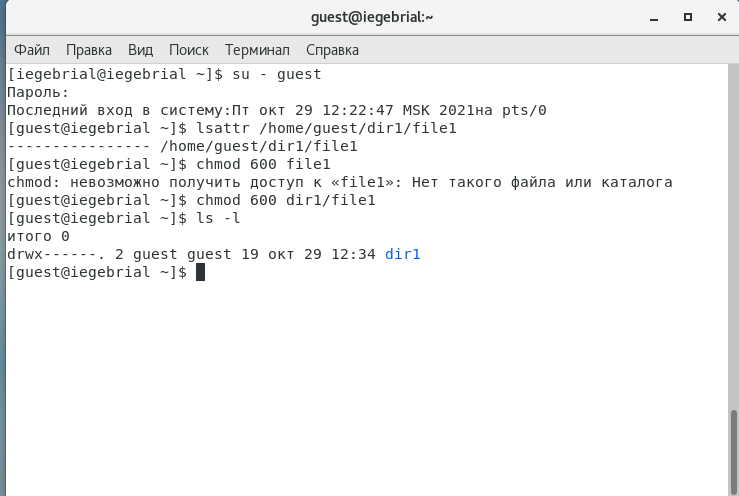
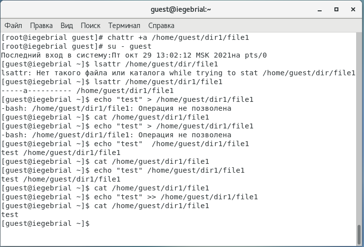
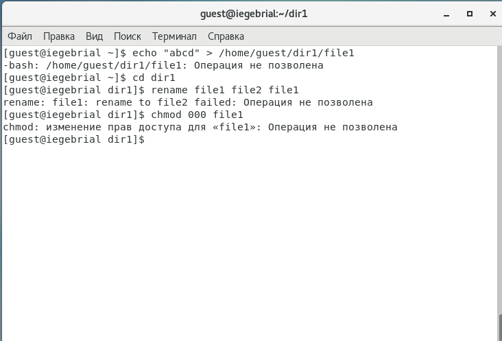
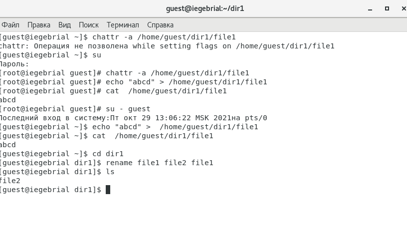
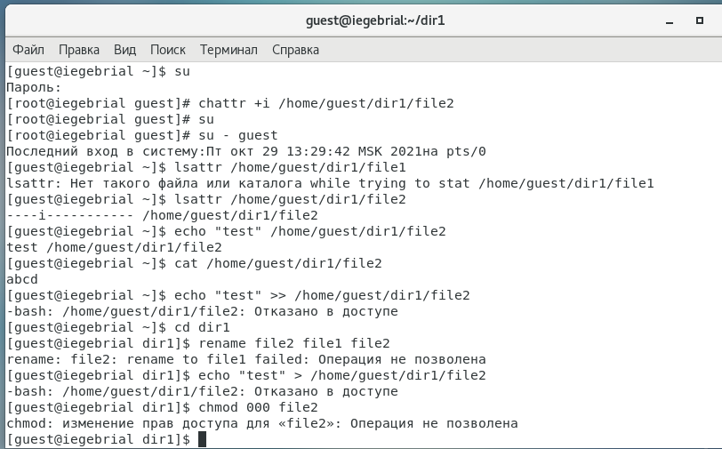
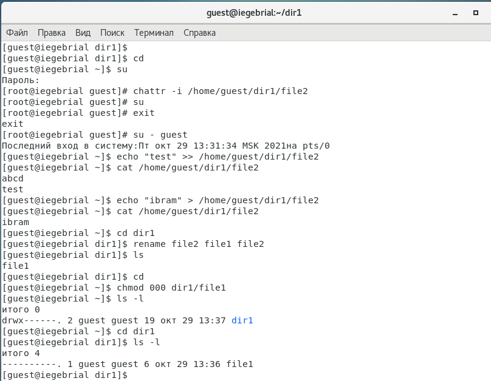

---
## Front matter
lang: ru-RU
title: Дискреционное разграничение прав в Linux. Расширенные атрибуты.
author: |
	Гебриал Ибрам \inst{1}
	
institute: |
	\inst{1}RUDN University, Moscow, Russian Federation
	
date: 2021 Moscow, Russia

## Formatting
toc: false
slide_level: 2
theme: metropolis
header-includes: 
 - \metroset{progressbar=frametitle,sectionpage=progressbar,numbering=fraction}
 - '\makeatletter'
 - '\beamer@ignorenonframefalse'
 - '\makeatother'
aspectratio: 43
section-titles: true
---

# Цель работы

## Цель работы

Получение практических навыков работы в консоли с расширенными атрибутами файлов.

# Результаты

## Результаты

Установил расширенные атрибуты файла (рис. -@fig:001)(рис. -@fig:002)

{ #fig:001 width=50% }

## Результаты

{ #fig:002 width=70% }

## Результаты

3. Попоробовал стереть имеющуюся в file1 информацию и переменовать файла.(рис. -@fig:003)

{ #fig:003 width=70% }

## Результаты

Снимал атрибут а и попоробовал такие действие ещё раз(рис. -@fig:004)

{ #fig:004 width=70% }

## Результаты

Установил атрибут i и повторил такжхе действие (рис. -@fig:005) 

{ #fig:005 width=70% }

## Результаты

Снимал атрибут i и проверял также действие (рис. -@fig:006) 

{ #fig:006 width=70% }

## Вывод

Получил практические навыки работы в консоли с расширенными атрибутами файлов.

## {.standout}

Спасибо за внимание 
