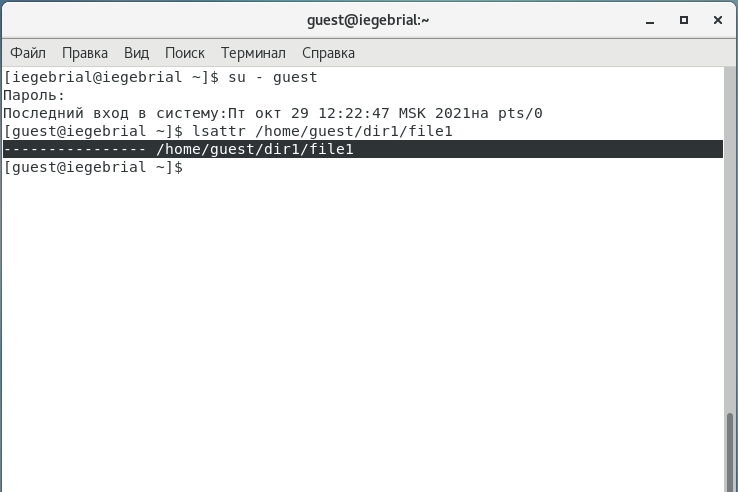
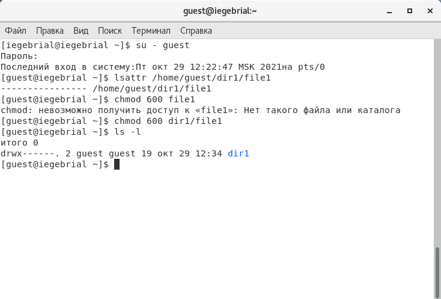
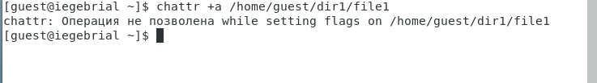
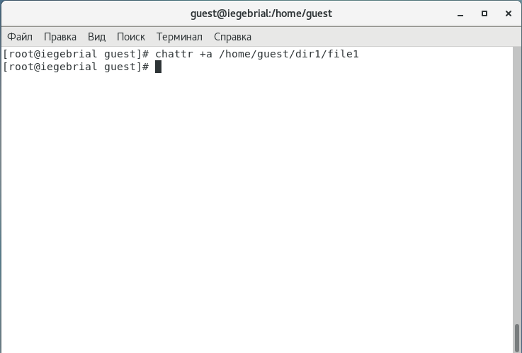
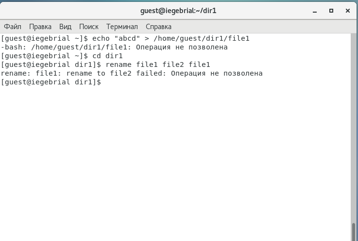
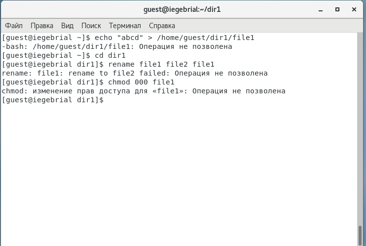
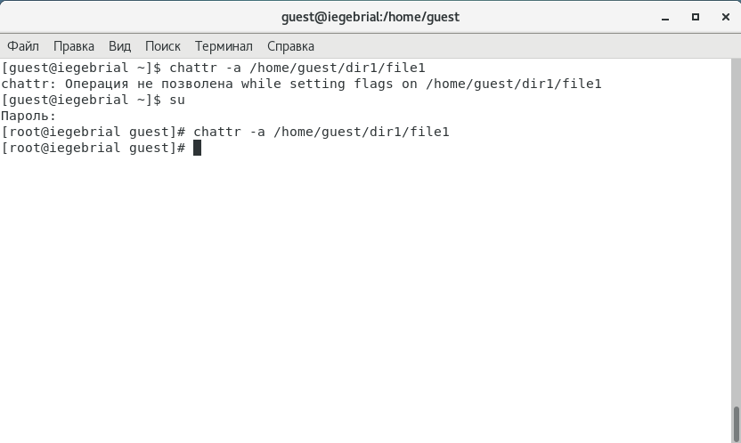
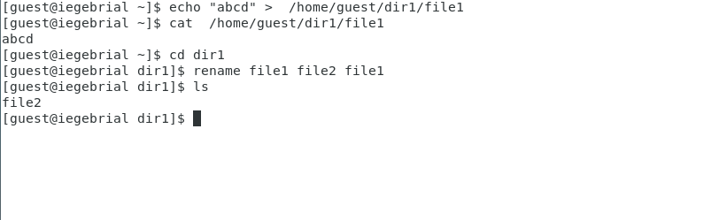
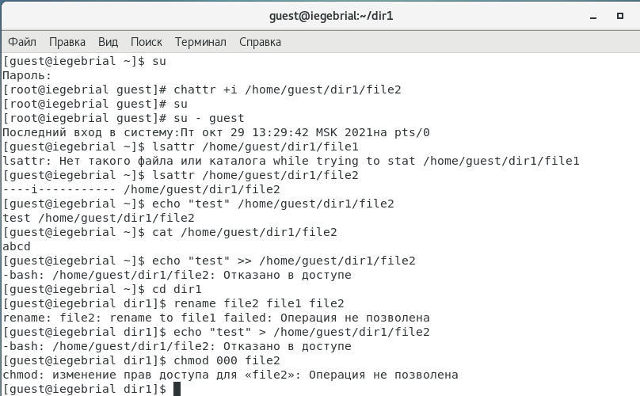
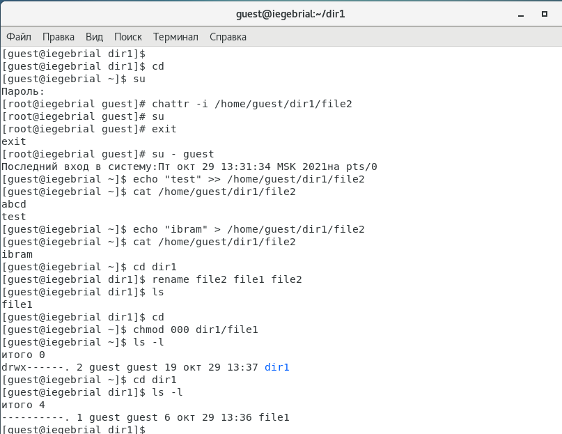

---
# Front matter
lang: ru-RU
title: "Отчёт по лабораторной работе 4"
subtitle: "Дискреционное разграничение прав в Linux. Расширенные атрибуты"
author: "Гебриал Ибрам Есам Зекри НПИ-01-18"

# Formatting
toc-title: "Содержание"
toc: true # Table of contents
toc_depth: 2
lof: true # List of figures
lot: true # List of tables
fontsize: 12pt
linestretch: 1.5
papersize: a4paper
documentclass: scrreprt
polyglossia-lang: russian
polyglossia-otherlangs: english
mainfont: PT Serif
romanfont: PT Serif
sansfont: PT Sans
monofont: PT Mono
mainfontoptions: Ligatures=TeX
romanfontoptions: Ligatures=TeX
sansfontoptions: Ligatures=TeX,Scale=MatchLowercase
monofontoptions: Scale=MatchLowercase
indent: true
pdf-engine: lualatex
header-includes:
  - \linepenalty=10 # the penalty added to the badness of each line within a paragraph (no associated penalty node) Increasing the value makes tex try to have fewer lines in the paragraph.
  - \interlinepenalty=0 # value of the penalty (node) added after each line of a paragraph.
  - \hyphenpenalty=50 # the penalty for line breaking at an automatically inserted hyphen
  - \exhyphenpenalty=50 # the penalty for line breaking at an explicit hyphen
  - \binoppenalty=700 # the penalty for breaking a line at a binary operator
  - \relpenalty=500 # the penalty for breaking a line at a relation
  - \clubpenalty=150 # extra penalty for breaking after first line of a paragraph
  - \widowpenalty=150 # extra penalty for breaking before last line of a paragraph
  - \displaywidowpenalty=50 # extra penalty for breaking before last line before a display math
  - \brokenpenalty=100 # extra penalty for page breaking after a hyphenated line
  - \predisplaypenalty=10000 # penalty for breaking before a display
  - \postdisplaypenalty=0 # penalty for breaking after a display
  - \floatingpenalty = 20000 # penalty for splitting an insertion (can only be split footnote in standard LaTeX)
  - \raggedbottom # or \flushbottom
  - \usepackage{float} # keep figures where there are in the text
  - \floatplacement{figure}{H} # keep figures where there are in the text
---

# Цель работы

Получение практических навыков работы в консоли с расширенными атрибутами файлов.

# Теоретические сведения

В Linux, как и в любой многопользовательской системе, абсолютно естественным образом возникает задача разграничения доступа субъектов — пользователей к объектам — файлам дерева каталогов.

Один из подходов к разграничению доступа — так называемый дискреционный (от англ, discretion — чье-либо усмотрение) — предполагает назначение владельцев объектов, которые по собственному усмотрению определяют права доступа субъектов (других пользователей) к объектам (файлам), которыми владеют.

Дискреционные механизмы разграничения доступа используются для разграничения прав доступа процессов как обычных пользователей, так и для ограничения прав системных программ в (например, служб операционной системы), которые работают от лица псевдопользовательских учетных записей. [1]

Предположим вы хотите защитить некоторые важные файлы в Linux. При чем они должны быть защищены не только от перезаписи но и от случайного или преднамеренного удаления и перемещения. Предотвратить перезапись или изменение битов доступа к файлов можно с помощью стандартных утилит chmod и chown, но это не идеальное решение, так как у суперпользователя по прежнему остается полный доступ. Но есть еще одно решение. Это команда chattr.

Утилиты chattr и lsattr входят в пакет e2fsprogs и предустановлены во всех современных дистрибутивах. Базовый синтаксис chattr выглядит следующим образом:

chattr опции [оператор][атрибуты] файлы

Вот основные опции утилиты, которые вы можете использовать:

-R - рекурсивная обработка каталога;

-V - максимально подробный вывод;

-f - игнорировать сообщения об ошибках;

-v - вывести версию.

Оператор может принимать значения:

+ - включить выбранные атрибуты;

- - отключить выбранные атрибуты;

= - оставить значение атрибута таким, каким оно было у файла.

Вот некоторые доступные атрибуты:

a - файл может быть открыт только в режиме добавления;

A - не обновлять время перезаписи;

c - автоматически сжимать при записи на диск;

C - отключить копирование при записи;

D - работает только для папки, когда установлен, все изменения синхронно записываются на диск сразу же;

e - использовать extent'ы блоков для хранения файла;

i - сделать неизменяемым;

j - все данные перед записью в файл будут записаны в журнал;

s - безопасное удаление с последующей перезаписью нулями;

S - синхронное обновление, изменения файлов с этим атрибутом будут сразу же записаны на диск;

t - файлы с этим атрибутом не будут хранится в отдельных блоках;

u - содержимое файлов с этим атрибутом не будет удалено при удалении самого файла и потом может быть восстановлено. [2]

# Выполнение лабораторной работы

1. От имени пользователя guest определил расширенные атрибуты файла /home/guest/dir1/file1 (рис. -@fig:001)

С помощью команды: 

lsattr /home/guest/dir1/file1

{ #fig:001 width=70% }

2. Установил командой chmod на файл file1 права, разрешающие чтение и запись для владельца фай-
ла. (рис. -@fig:002)

С помощью команды: 

chmod 600 file1

{ #fig:002 width=70% }

3. Попробовал установить на файл /home/guest/dir1/file1 расширенный атрибут a от имени пользователя guest (рис. -@fig:003):

С помощью команды:

chattr +a /home/guest/dir1/file1 

В ответ получил отказ от выполнения операции.

{ #fig:003 width=70% }

4. Повысил свои права с помощью команды su. установил расширенный атрибут a на файл /home/guest/dir1/file1 от имени суперпользователя:(рис. -@fig:004)

{ #fig:004 width=70% }

5.От пользователя guest проверил правильность установления атрибута: (рис. -@fig:005)

.png){ #fig:005 width=70% }

6. Выполнил дозапись в файл file1 слова «test» командой echo "test" /home/guest/dir1/file1 После этого выполнил чтение файла file1 командой cat /home/guest/dir1/file1 (рис. -@fig:006)

{ #fig:006 width=70% }

7. Попробовал удалить файл file1 либо стереть имеющуюся в нём информацию командой echo "abcd" > /home/guest/dirl/file1 Попробовал переименовать файл. (рис. -@fig:007)

{ #fig:007 width=70% }

8. Попробовал с помощью команды chmod 000 file1 установить на файл file1 права, например, запрещающие чтение и запись для владельца файла. (рис. -@fig:008)

Не удалось установить. 

{ #fig:008 width=70% }

9. Снимил расширенный атрибут a с файла /home/guest/dirl/file1 от имени суперпользователя командой chattr -a /home/guest/dir1/file1: (рис. -@fig:009)

{ #fig:009 width=70% }

10. Повторил операции, которые мнеранее не удавалось выполнить. (рис. -@fig:010)

Получилось у нас произвести все изменение.

{ #fig:010 width=70% }

11. Повторил все действия по шагам, заменив атрибут «a» атрибутом «i».  (рис. -@fig:011)

ни одного действие не получилось делать.

{ #fig:011 width=70% }

12. Снимал атрибут «i» и повторил действии.  (рис. -@fig:012)

Получилось делать все действии.

{ #fig:012 width=70% }

# Выводы

Получил практические навыки работы в консоли с расширенными атрибутами файлов.

# Список литературы

1. Дискреционное разграничение доступа Linux. // Алексеев.Д. URL:https://debianinstall.ru

/diskretsionnoe-razgranichenie-dostupa-linux/ (дата обращения 27.11.2018). 

2. Команда CHATTR в LINUX. //Losst.2020. URL:https://losst.ru/neizmenyaemye-fajly-v-linux (дата обращения 4.05.2020). 