---
## Front matter
lang: ru-RU
title: Дискреционное разграничение прав в Linux. Исследование влияния дополнительных атрибутов.
author: |
	Гебриал Ибрам \inst{1}
	
institute: |
	\inst{1}RUDN University, Moscow, Russian Federation
	
date: 2021 Moscow, Russia

## Formatting
toc: false
slide_level: 2
theme: metropolis
header-includes: 
 - \metroset{progressbar=frametitle,sectionpage=progressbar,numbering=fraction}
 - '\makeatletter'
 - '\beamer@ignorenonframefalse'
 - '\makeatother'
aspectratio: 43
section-titles: true
---

# Цель работы

## Цель работы

Изучение механизмов изменения идентификаторов, применения SetUID- и Sticky-битов. Получение практических навыков работы в консоли с дополнительными атрибутами. Рассмотрение работы механизма смены идентификатора процессов пользователей, а также влияние бита Sticky на запись и удаление файлов.

# Результаты

## Результаты

Cоздал программу simpleid.c. (рис. -@fig:001)

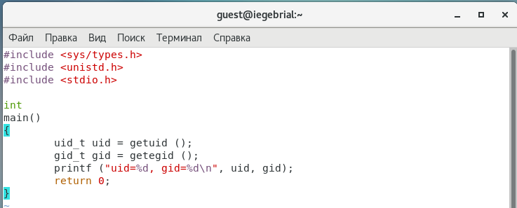{ #fig:001 width=70% }

## Результаты

Выполнил программу simpleid и выполнил системную программу id. (рис. -@fig:002)

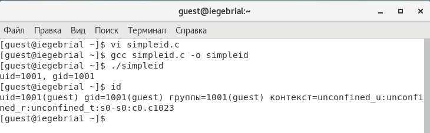{ #fig:002 width=70% }

## Результаты

Усложнил программу, добавив вывод действительных идентификаторов. (рис. -@fig:003)

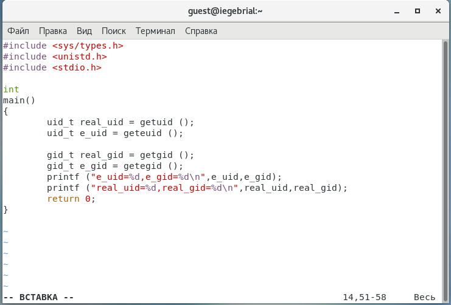{ #fig:003 width=70% }

## Результаты

Скомпилировал и запустил simpleid2.c. (рис. -@fig:004)

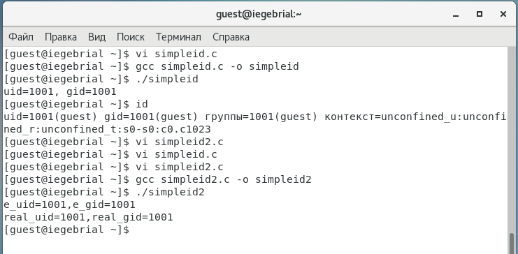{ #fig:004 width=70% }

## Результаты

От имени суперпользователя выполнил команды. (рис. -@fig:005)

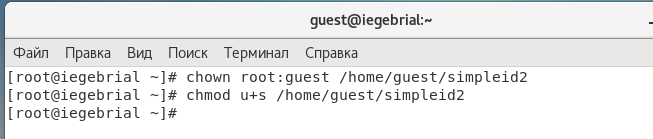{ #fig:005 width=70% }

Выполнил проверку правильности установки новых атрибутов и смены владельца файла simpleid2. (рис. -@fig:006)

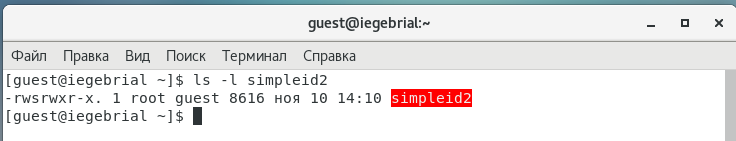{ #fig:006 width=70% }

## Результаты

Создал программу readfile.c. (рис. -@fig:007)

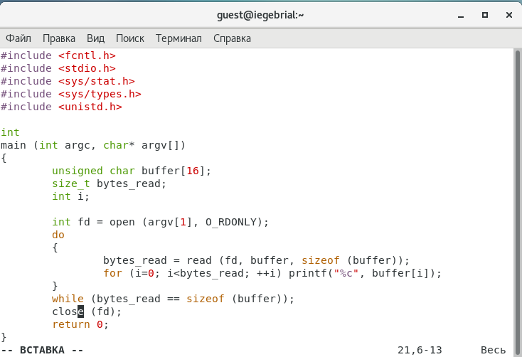{ #fig:007 width=70% }

## Результаты

Откомпилировал её. (рис. -@fig:008)

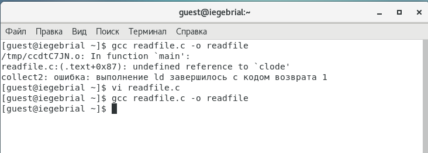{ #fig:008 width=70% }

## Результаты

Сменил владельца у файла readfile.c  и изменил права так, чтобы только суперпользователь (root) мог прочитать его, a guest не мог. (рис. -@fig:009)

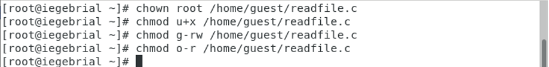{ #fig:009 width=60% }

Проверил, что пользователь guest не может прочитать файл readfile.c. (рис. -@fig:010)

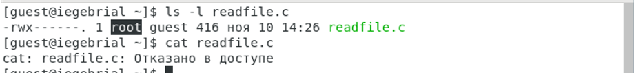{ #fig:010 width=60% }

## Результаты

Выяснил, установлен ли атрибут Sticky на директории /tmp и От имени пользователя guest создал файл file01.txt (рис. -@fig:011)

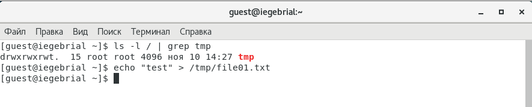{ #fig:011 width=60% }

От пользователя guest2 попробовал дозаписи в файла, записи, удаления файла и проверка.(рис. -@fig:012)

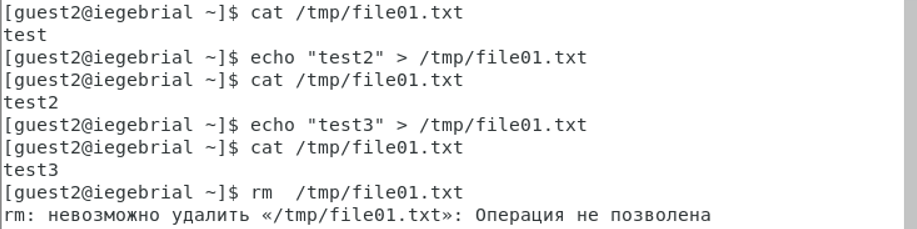{ #fig:012 width=60% }

## Результаты

Повысил свои права до суперпользователя и выполнил после этого команду, снимающую атрибут t (Sticky-бит). (рис. -@fig:013)

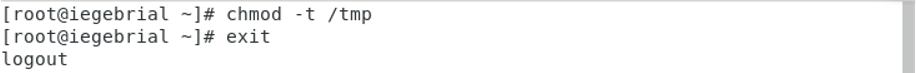{ #fig:013 width=70% }

Повторил предыдущие шаги. Получилось удалить файл . (рис. -@fig:014)

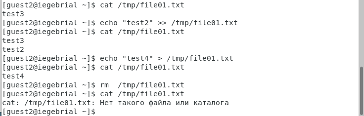{ #fig:014 width=70% }

## Результаты

Повысил свои права до суперпользователя и вернил атрибут t на директорию /tmp . (рис. -@fig:015)

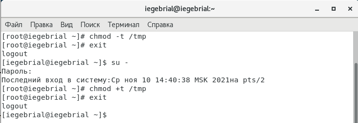{ #fig:015 width=70% }

## Вывод

Изучал механизм изменения идентификаторов, применения SetUID- и Sticky-битов. Получил практические навыки работы в консоли с дополнительными атрибутами. Рассмотрел работу механизма смены идентификатора процессов пользователей, а также влияние бита Sticky на запись и удаление файлов.

## {.standout}

Спасибо за внимание 
