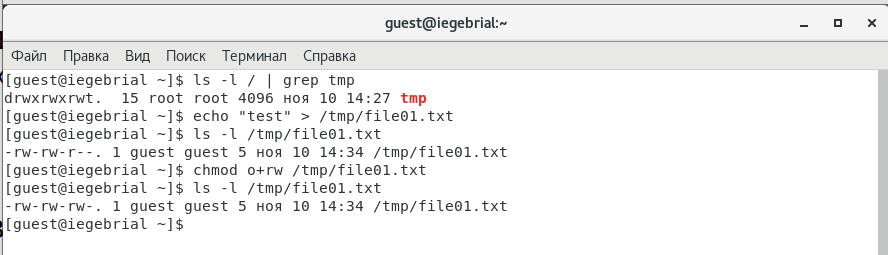

---
# Front matter
lang: ru-RU
title: "Отчёт по лабораторной работе 5"
subtitle: "Дискреционное разграничение прав в Linux. Исследование влияния дополнительных атрибутов"
author: "Гебриал Ибрам Есам Зекри НПИ-01-18"

# Formatting
toc-title: "Содержание"
toc: true # Table of contents
toc_depth: 2
lof: true # List of figures
lot: true # List of tables
fontsize: 12pt
linestretch: 1.5
papersize: a4paper
documentclass: scrreprt
polyglossia-lang: russian
polyglossia-otherlangs: english
mainfont: PT Serif
romanfont: PT Serif
sansfont: PT Sans
monofont: PT Mono
mainfontoptions: Ligatures=TeX
romanfontoptions: Ligatures=TeX
sansfontoptions: Ligatures=TeX,Scale=MatchLowercase
monofontoptions: Scale=MatchLowercase
indent: true
pdf-engine: lualatex
header-includes:
  - \linepenalty=10 # the penalty added to the badness of each line within a paragraph (no associated penalty node) Increasing the value makes tex try to have fewer lines in the paragraph.
  - \interlinepenalty=0 # value of the penalty (node) added after each line of a paragraph.
  - \hyphenpenalty=50 # the penalty for line breaking at an automatically inserted hyphen
  - \exhyphenpenalty=50 # the penalty for line breaking at an explicit hyphen
  - \binoppenalty=700 # the penalty for breaking a line at a binary operator
  - \relpenalty=500 # the penalty for breaking a line at a relation
  - \clubpenalty=150 # extra penalty for breaking after first line of a paragraph
  - \widowpenalty=150 # extra penalty for breaking before last line of a paragraph
  - \displaywidowpenalty=50 # extra penalty for breaking before last line before a display math
  - \brokenpenalty=100 # extra penalty for page breaking after a hyphenated line
  - \predisplaypenalty=10000 # penalty for breaking before a display
  - \postdisplaypenalty=0 # penalty for breaking after a display
  - \floatingpenalty = 20000 # penalty for splitting an insertion (can only be split footnote in standard LaTeX)
  - \raggedbottom # or \flushbottom
  - \usepackage{float} # keep figures where there are in the text
  - \floatplacement{figure}{H} # keep figures where there are in the text
---

# Цель работы

Изучение механизмов изменения идентификаторов, применения SetUID- и Sticky-битов. Получение практических навыков работы в консоли с дополнительными атрибутами. Рассмотрение работы механизма смены идентификатора процессов пользователей, а также влияние бита Sticky на запись и удаление файлов.

# Теоретические сведения

Linux — многопользовательская система, поэтому она должна предоставлять систему разрешений, чтобы контролировать авторизованные операции с файлами и каталогами, к которым относятся все системные ресурсы и устройства (в Unix-системах любое устройство представляется в виде файла или каталога). Этот принцип является общим для всех Unix-систем, но напомнить об этом ещё раз будет не лишним, тем более что существуют некоторые интересные и сравнительно малоизвестные способы применения.

У каждого файла и каталога имеются специальные разрешения для трёх категорий пользователей:

- его владельца (обозначается u, от «user»);
- его группы-владельца (обозначается g, от «group»), представленная всеми членами группы;
- остальных (обозначается o, от «other»).

Три типа прав могут использоваться совместно:

- чтение (обозначается r, от «read»);
- запись (или изменение, обозначается w, от «write»);
- исполнение (обозначается x, от «eXecute»).

Два своеобразных права имеют смысл для исполняемых файлов: setuid и setgid (обозначаются буквой «s»). Обратите внимание, что они часто называются «битами», поскольку каждое из этих логических значений может быть представлено как 0 или 1. Эти два права позволяют любому пользователю выполнять программу на правах её владельца или группы соответственно. Данный механизм предоставляет доступ к функциям, требующим разрешений более высокого уровня, чем обычно есть у пользователя.

Поскольку setuid-программа, принадлежащая root, систематически запускается с правами суперпользователя, крайне важно убедиться в её безопасности и надёжности. Действительно, пользователь, которому удастся заставить её вызвать другую произвольную программу, сможет представиться как root и получить все права в системе. [1]

Чтобы применить соответствующие разрешения, первое, что нужно учитывать, это владение. Для этого есть команда chown.

Для управления правами используется команда chmod. При использовании chmod мы можем устанавливать разрешения для пользователя (user), группы (group) и других (other). [2]

# Выполнение лабораторной работы

1. Отключил систему SELinux. (рис. -@fig:001)

{ #fig:001 width=70% }

2. Вошёл в систему от имени пользователя guest и создал программу simpleid.c. (рис. -@fig:002)

{ #fig:002 width=70% }

3. Скомплилировал программу. (рис. -@fig:003)

С помощью команды:
 
gcc simpleid.c -o simpleid 

{ #fig:003 width=70% }

4. Выполнил программу simpleid и выполнил системную программу id. (рис. -@fig:004)

При сравнении результата id и simpleid получил одинаковые данны.

{ #fig:004 width=70% }

5. Усложнил программу, добавив вывод действительных идентификаторов. (рис. -@fig:005)

{ #fig:005 width=70% }

6. Скомпилировал и запустил simpleid2.c. (рис. -@fig:006)

{ #fig:006 width=70% }

7. От имени суперпользователя выполнил команды. (рис. -@fig:007)

chown root:guest /home/guest/simpleid2 - поменял пользователь на root и группа на guest.

chmod u+s /home/guest/simpleid2 - разрешение для владельца на выполнение с разрешением суперпользователя.

{ #fig:007 width=70% }

8. Выполнил проверку правильности установки новых атрибутов и смены владельца файла simpleid2. (рис. -@fig:008)

{ #fig:008 width=70% }

9. Запустил simpleid2 и id. (рис. -@fig:009)

{ #fig:009 width=70% }

10. Проделал тоже самое относительно SetGID-бита. (рис. -@fig:010)

{ #fig:010 width=70% }

11. Создал программу readfile.c. (рис. -@fig:011)

{ #fig:011 width=70% }

12. Откомпилировал её. (рис. -@fig:012)

с помощью команды:

gcc readfile.c -o readfile

{ #fig:012 width=70% }

13. Сменил владельца у файла readfile.c (или любого другого текстового файла в системе) и изменил права так, чтобы только суперпользователь (root) мог прочитать его, a guest не мог.. (рис. -@fig:013)

{ #fig:013 width=70% }

14. Проверил, что пользователь guest не может прочитать файл readfile.c. (рис. -@fig:014)

{ #fig:014 width=70% }

15. Сменил у программы readfile владельца и установил SetU’D-бит. (рис. -@fig:015)

{ #fig:015 width=70% }

16. Проверил, что программа readfile может прочитать файл readfile.c. (рис. -@fig:016)

Да получилось для программы readfile читать файл readfile.c.

{ #fig:016 width=70% }

17. Проверил, что программа readfile может прочитать файл /etc/shadow. (рис. -@fig:017)

Да получилось для программы readfile читать файл /etc/shadow. 

{ #fig:017 width=70% }

18. Выяснил, установлен ли атрибут Sticky на директории /tmp (рис. -@fig:018)

С помощью команды 

ls -l / | grep tmp 

{ #fig:018 width=70% }

19. От имени пользователя guest создал файл file01.txt в директории /tmp со словом test. (рис. -@fig:019)

{ #fig:019 width=70% }

20. Просмотрел атрибуты у только что созданного файла и разрешил чтение и запись для категории пользователей «все остальные». (рис. -@fig:020)

{ #fig:020 width=70% }

21. Просмотрел атрибуты у только что созданного файла и разрешил чтение и запись для категории пользователей «все остальные». (рис. -@fig:021)

{ #fig:021 width=70% }

22. От пользователя guest2 попробовал дозаписать в файл /tmp/file01.txt слово test2 командой и проверял.Попробовал  записать в файл /tmp/file01.txt
слово test3, стерев при этом всю имеющуюся в файле информацию командой. Прроверил содержимое файла командой и потом постарлся удалить файл но не получилось удалить файл (рис. -@fig:022)

{ #fig:022 width=70% }

23. Повысил свои права до суперпользователя и выполнил после этого команду, снимающую атрибут t (Sticky-бит) с директории /tmp покинил режим суперпользователя командой. (рис. -@fig:023)

{ #fig:023 width=70% }

24. Повторил предыдущие шаги. Получилось удалить файл . (рис. -@fig:024)

{ #fig:024 width=70% }

25. Повысил свои права до суперпользователя и вернил атрибут t на директорию /tmp . (рис. -@fig:025)

{ #fig:025 width=70% }

# Выводы

Изучал механизм изменения идентификаторов, применения SetUID- и Sticky-битов. Получил практические навыки работы в консоли с дополнительными атрибутами. Рассмотрел работу механизма смены идентификатора процессов пользователей, а также влияние бита Sticky на запись и удаление файлов.

# Список литературы

1. Управление правами. https://debian-handbook.info/browse/ru-RU/stable/sect.rights-management.html. 

2. Права в Linux. //Losst.2020. URL:https://losst.ru/neizmenyaemye-fajly-v-linux (дата обращения 1.10.2019). 