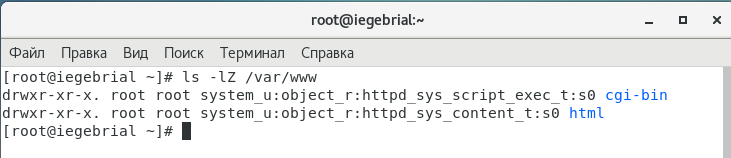

---
## Front matter
lang: ru-RU
title: Мандатное разграничение прав в Linux.
author: |
	Гебриал Ибрам \inst{1}
	
institute: |
	\inst{1}RUDN University, Moscow, Russian Federation
	
date: 2021 Moscow, Russia

## Formatting
toc: false
slide_level: 2
theme: metropolis
header-includes: 
 - \metroset{progressbar=frametitle,sectionpage=progressbar,numbering=fraction}
 - '\makeatletter'
 - '\beamer@ignorenonframefalse'
 - '\makeatother'
aspectratio: 43
section-titles: true
---

# Цель работы

## Цель работы

Развить навыки администрирования ОС Linux. Получить первое практическое знакомство с технологией SELinux. Проверить работу SELinx на практике совместно с веб-сервером Apache.

# Результаты

## Результаты

1. Вошёл в систему с полученными учётными данными и убедитесь, что SELinux работает в режиме enforcing политики targeted с помощью команд getenforce и sestatus. (рис. -@fig:001)

{ #fig:001 width=70% }

## Результаты

Проверял статус httpd. (рис. -@fig:002)

{ #fig:002 width=70% }

## Результаты

Нашёл веб-сервер Apache в списке процессов, определил его контекст безопасности. (рис. -@fig:003)

{ #fig:003 width=70% }

## Результаты

Посмотрел текущее состояние переключателей SELinux для Apache. (рис. -@fig:004)

{ #fig:004 width=70% }

## Результаты

Посмотрел статистику по политике с помощью команды seinfo (рис. -@fig:005)

{ #fig:005 width=70% }

## Результаты

Определил тип файлов и поддиректорий, находящихся в директории /var/www  (рис. -@fig:006)

{ #fig:006 width=70% }

## Результаты

Создал html-файл /var/www/html/test.html. (рис. -@fig:007)

{ #fig:007 width=70% }

## Результаты

Обратился к файлу через веб-сервер, введя в браузере адрес http://127.0.0.1/test.html . (рис. -@fig:008)

{ #fig:008 width=60% }

## Результаты

Изменил контекст файла /var/www/html/test.html с httpd_sys_content_t на любой другой (рис. -@fig:009)

{ #fig:009 width=60% }

Попробовал ещё раз получить доступ к файлу через веб-сервер, введя в браузере адрес http://127.0.0.1/test.html.(рис. -@fig:010)

{ #fig:010 width=60% }

## Результаты

Просмотрел log-файлы веб-сервера Apache. (рис. -@fig:011)

{ #fig:011 width=70% }

## Результаты

Открыл файл /etc/httpd/httpd.conf нашёл строчку Listen 80 и заменил её на Listen 81.  (рис. -@fig:012)

{ #fig:012 width=70% }

## Результаты

Проанализировал лог-файлы.  (рис. -@fig:013)

{ #fig:013 width=70% }

Выполнил команду semanage port -a -t http_port_t -р tcp 81. После этого проверил список портов командой.  (рис. -@fig:014)

{ #fig:014 width=70% }

## Результаты

Вернил контекст httpd_sys_cоntent__t к файлу /var/www/html/ test.html (рис. -@fig:015)

{ #fig:015 width=70% }

Попробовал получить доступ к файлу через веб-сервер, введя в браузере адрес http://127.0.0.1:81/test.html (рис. -@fig:016)

{ #fig:016 width=70% }

## Результаты

 Исправил обратно конфигурационный файл apache, вернув Listen 80.(рис. -@fig:017)

{ #fig:017 width=70% }

## Результаты

Удалил привязку http_port_t к 81 порту и удалил файл /var/www/html/test.html.(рис. -@fig:018)

{ #fig:018 width=70% }

## Вывод

Развил навыки администрирования ОС Linux. Получил первое практическое знакомство с технологией SELinux.
Проверил работу SELinx на практике совместно с веб-сервером Apache.

## {.standout}

Спасибо за внимание 
