---
# Front matter
lang: ru-RU
title: "Отчёт по лабораторной работе 6"
subtitle: "Мандатное разграничение прав в Linux"
author: "Гебриал Ибрам Есам Зекри НПИ-01-18"

# Formatting
toc-title: "Содержание"
toc: true # Table of contents
toc_depth: 2
lof: true # List of figures
lot: true # List of tables
fontsize: 12pt
linestretch: 1.5
papersize: a4paper
documentclass: scrreprt
polyglossia-lang: russian
polyglossia-otherlangs: english
mainfont: PT Serif
romanfont: PT Serif
sansfont: PT Sans
monofont: PT Mono
mainfontoptions: Ligatures=TeX
romanfontoptions: Ligatures=TeX
sansfontoptions: Ligatures=TeX,Scale=MatchLowercase
monofontoptions: Scale=MatchLowercase
indent: true
pdf-engine: lualatex
header-includes:
  - \linepenalty=10 # the penalty added to the badness of each line within a paragraph (no associated penalty node) Increasing the value makes tex try to have fewer lines in the paragraph.
  - \interlinepenalty=0 # value of the penalty (node) added after each line of a paragraph.
  - \hyphenpenalty=50 # the penalty for line breaking at an automatically inserted hyphen
  - \exhyphenpenalty=50 # the penalty for line breaking at an explicit hyphen
  - \binoppenalty=700 # the penalty for breaking a line at a binary operator
  - \relpenalty=500 # the penalty for breaking a line at a relation
  - \clubpenalty=150 # extra penalty for breaking after first line of a paragraph
  - \widowpenalty=150 # extra penalty for breaking before last line of a paragraph
  - \displaywidowpenalty=50 # extra penalty for breaking before last line before a display math
  - \brokenpenalty=100 # extra penalty for page breaking after a hyphenated line
  - \predisplaypenalty=10000 # penalty for breaking before a display
  - \postdisplaypenalty=0 # penalty for breaking after a display
  - \floatingpenalty = 20000 # penalty for splitting an insertion (can only be split footnote in standard LaTeX)
  - \raggedbottom # or \flushbottom
  - \usepackage{float} # keep figures where there are in the text
  - \floatplacement{figure}{H} # keep figures where there are in the text
---

# Цель работы

Развить навыки администрирования ОС Linux. Получить первое практическое знакомство с технологией SELinux. 

Проверить работу SELinx на практике совместно с веб-сервером Apache.

# Теоретические сведения

Linux с улучшенной безопасностью (SELinux) - это реализация мандатного управления доступом mandatory access control в ядре Linux, проверяющего разрешение операций после проверки стандартного дискреционного управления доступом discretionary access controls. SELinux создан Агенством Национальной Безопасности и вводит в действие правила для файлов и процессов в системе Linux, для совершаемых над ними действий, основываясь на установленной политике.

При использовании SELinux, файлы, включая директории и устройства являются объектами. Процессы, такие как, выполнение команды пользователем или приложение Mozilla® Firefox®, являются субъектами. Большинство операционных систем используют механизм дискретного контроля доступа (Discretionary Access Control (DAC), который контролирует каким образом субъекты взаимодействуют с объектами, и как субъекты взаимодействуют друг с другом. В операционных системах с использованием DAC, пользователи контролируют права доступа к файлам (объектам), для которых они являются собственниками. Например, в операционных системах Linux®, пользователи могут сделать свои домашние директории читаемыми для всех, предоставив пользователям и процессам (субъектам) доступ к потенциально конфеденциальной информации, без какой либо защиты от этого нежелательных действий. [1]

**Режимы работы SELinux**

SELinux имеет три основных режим работы, при этом по умолчанию установлен режим Enforcing. Это довольно жесткий режим, и в случае необходимости он может быть изменен на более удобный для конечного пользователя.

Enforcing: Режим по-умолчанию. При выборе этого режима все действия, которые каким-то образом нарушают текущую политику безопасности, будут блокироваться, а попытка нарушения будет зафиксирована в журнале.

Permissive: В случае использования этого режима, информация о всех действиях, которые нарушают текущую политику безопасности, будут зафиксированы в журнале, но сами действия не будут заблокированы.

Disabled: Полное отключение системы принудительного контроля доступа.[2]

# Выполнение лабораторной работы

**Подготовка лабораторного стенда**

1. При подготовке стенда обратил внимание, что необходимая для работы и указанная выше политика targeted и режим enforcing используются в данном дистрибутиве по умолчанию. (рис. -@fig:001)

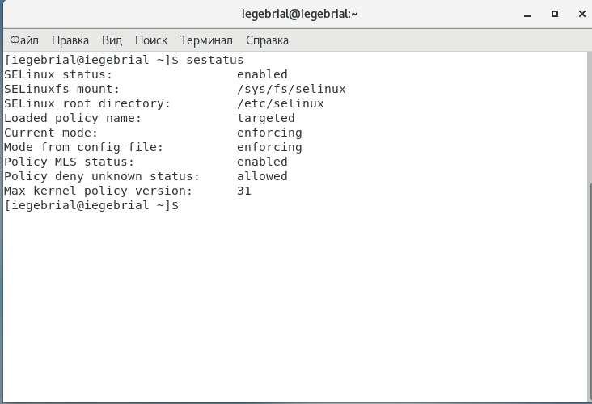{ #fig:001 width=70% }

2. В конфигурационном файле /etc/httpd/httpd.conf задал параметр ServerName: (рис. -@fig:002)

Чтобы при запуске веб-сервера не выдавались лишние сообщения об ошибках, не относящихся к лабораторной работе.

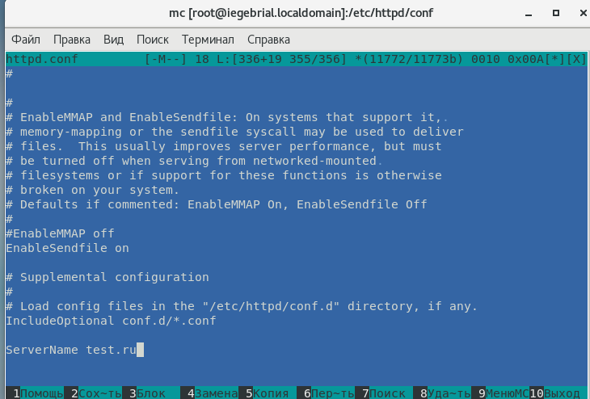{ #fig:002 width=70% }

3. Также необходимо проследить, чтобы пакетный фильтр был отключён или в своей рабочей конфигурации позволял подключаться к 80-у и 81-у портам протокола tcp. 

Отключил фильтр. (рис. -@fig:003)

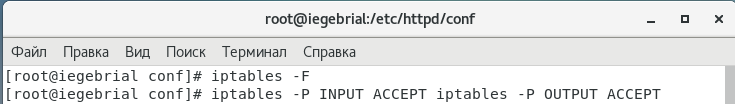{ #fig:003 width=70% }

4. Вошёл в систему с полученными учётными данными и убедитесь, что SELinux работает в режиме enforcing политики targeted с помощью команд getenforce и sestatus. (рис. -@fig:004)

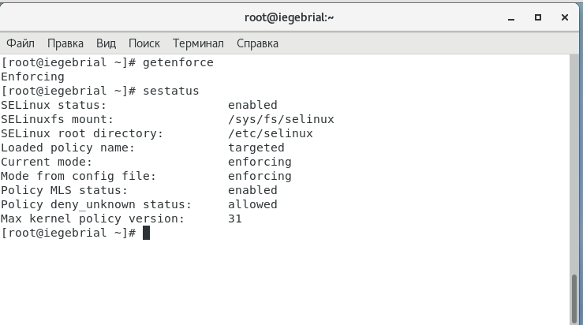{ #fig:004 width=70% }

5. Обратился с помощью браузера к веб-серверу, запущенному на своем компьютере, и убедился, что последний работает: (рис. -@fig:005)

Он не работал, поэтому запустил его так же, но с параметром start.

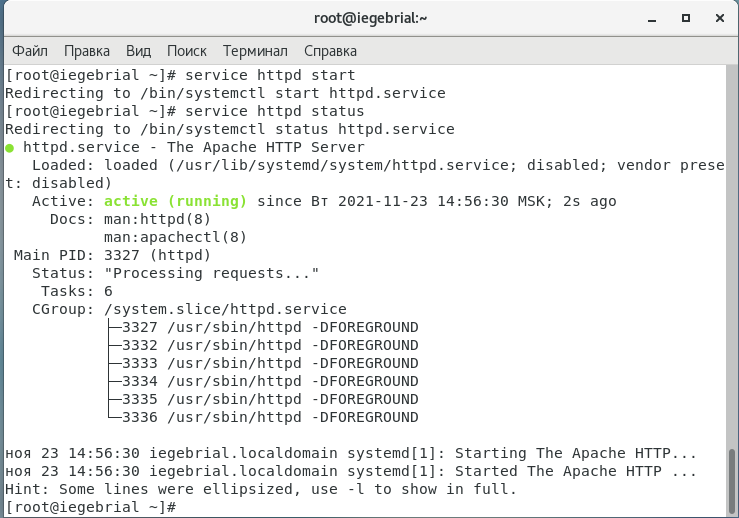{ #fig:005 width=70% }

6. Нашёл веб-сервер Apache в списке процессов, определил его контекст безопасности. (рис. -@fig:006)

system_u — системный пользователь;

system_r — роль уровня системы, используемая для запуска системных
процессов с указанием конкретного типа субъекта, определяемого типом
объекта (файла).

httpd_t- задан тип 

s0- задан уровень

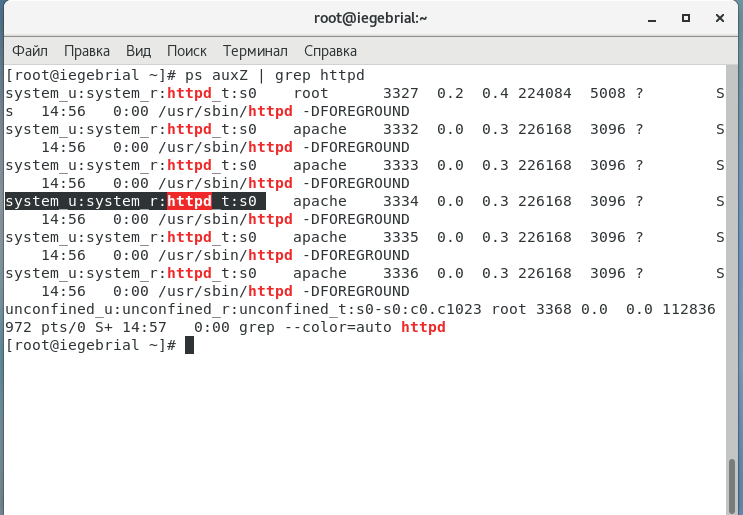{ #fig:006 width=70% }

7. Посмотрел текущее состояние переключателей SELinux для Apache. (рис. -@fig:007)

Можем заметить, что многие из них находятся в положении «off»

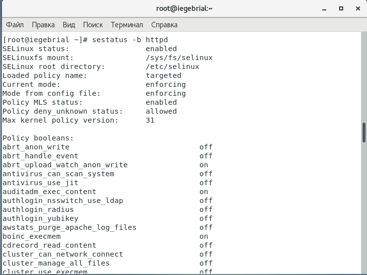{ #fig:007 width=70% }

8. Посмотрел статистику по политике с помощью команды seinfo (рис. -@fig:008)

пользователей 8

ролей 14

типов 4793

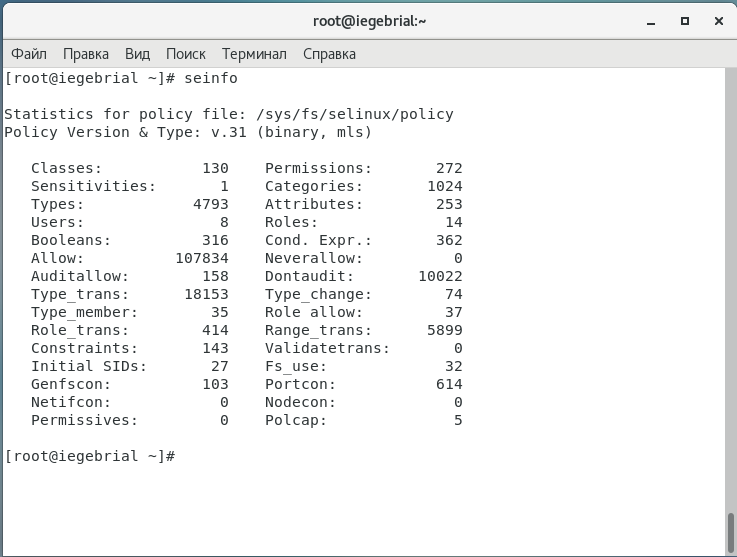{ #fig:008 width=70% }

9. Определил тип файлов и поддиректорий, находящихся в директории /var/www (рис. -@fig:009)

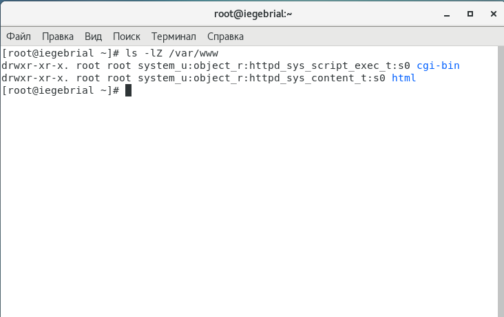{ #fig:009 width=70% }

10. Создал от имени суперпользователя (так как в дистрибутиве после установки только ему разрешена запись в директорию) html-файл /var/www/html/test.html следующего содержания и проверял его конескст. (рис. -@fig:010) (рис. -@fig:011)

unconfined_u — прочие пользователи;

object_r — роль, указываемая для объектов типа файл или каталог;

httpd_sys_content_t- тип

s0- уровень.

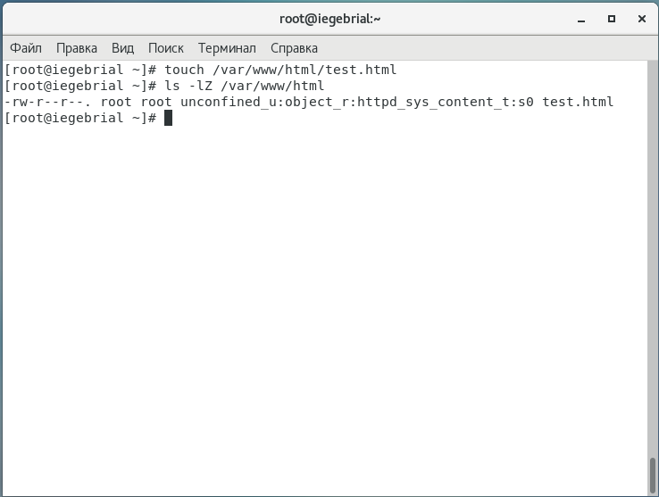{ #fig:010 width=70% }

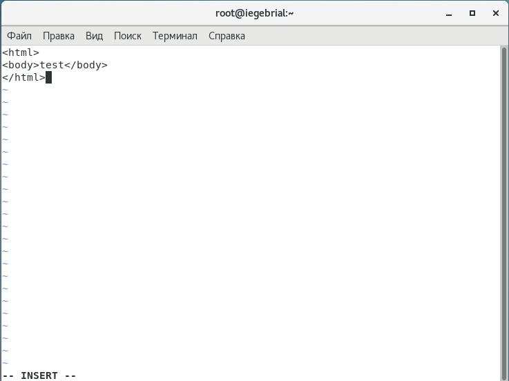{ #fig:011 width=70% }

11. Обратился к файлу через веб-сервер, введя в браузере адрес http://127.0.0.1/test.html (рис. -@fig:012)

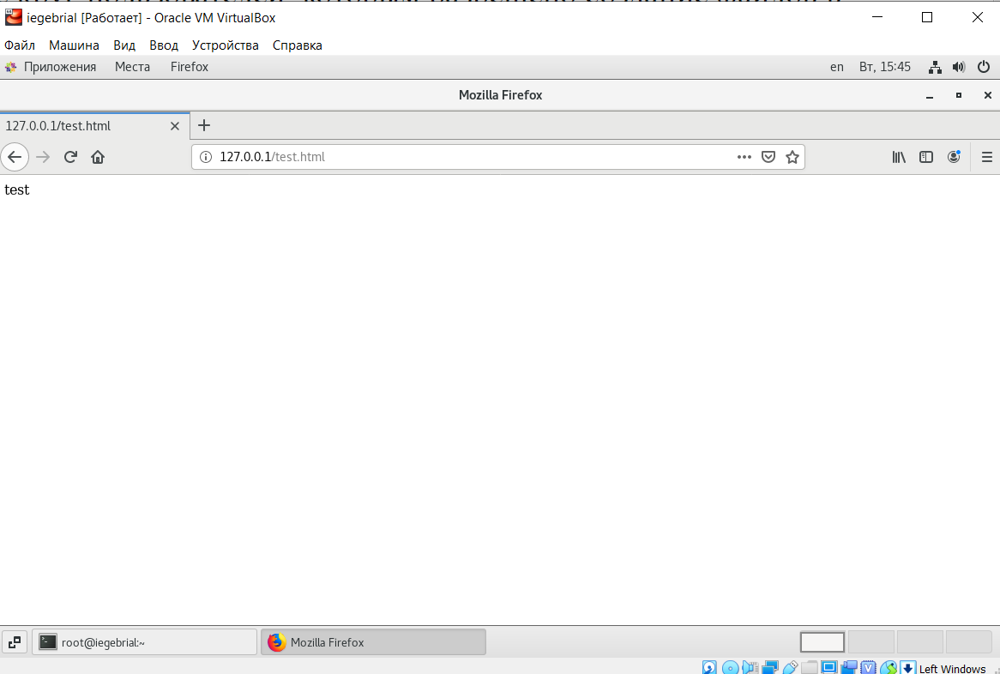{ #fig:012 width=70% }

12. Изменил контекст файла /var/www/html/test.html с httpd_sys_content_t на любой другой, к которому процесс httpd не должен иметь доступа, например, на samba_share_t: (рис. -@fig:013)

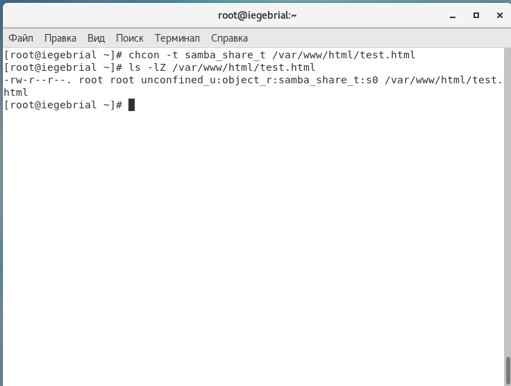{ #fig:013 width=70% }

13. Попробовал ещё раз получить доступ к файлу через веб-сервер, введя в браузере адрес http://127.0.0.1/test.html. (рис. -@fig:014)

Получил сообщение об ошибке: Forbidden
You don't have permission to access /test.html on this server.

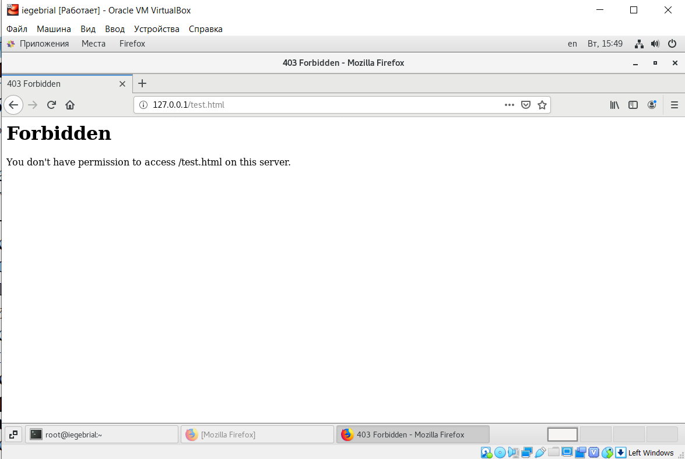{ #fig:014 width=70% }

14. Проанализировал ситуацию. (рис. -@fig:015) и просмотрел log-файлы веб-сервера Apache(рис. -@fig:016)

Заметил что не отображен потому что у httpd не доступа к типу файла. SeLinux запретил доступ из за разницы в контекстах.

{ #fig:015 width=70% }

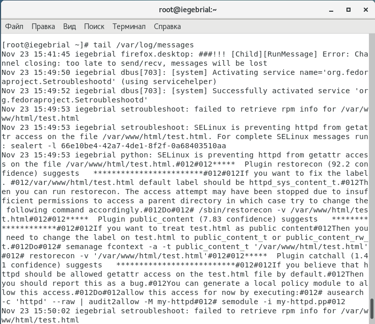{ #fig:016 width=70% }

15. Попробовал запустить веб-сервер Apache на прослушивание ТСР-порта 81 (а не 80, как рекомендует IANA и прописано в /etc/services). Для
этого в файле /etc/httpd/httpd.conf нашёл строчку Listen 80 и заменил её на Listen 81. (рис. -@fig:017)

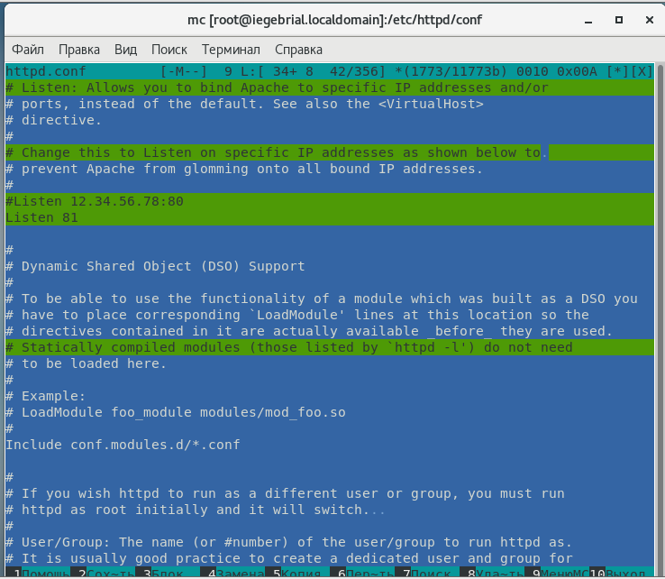{ #fig:017 width=70% }

16. Выполнил перезапуск веб-сервера Apache. (рис. -@fig:018)

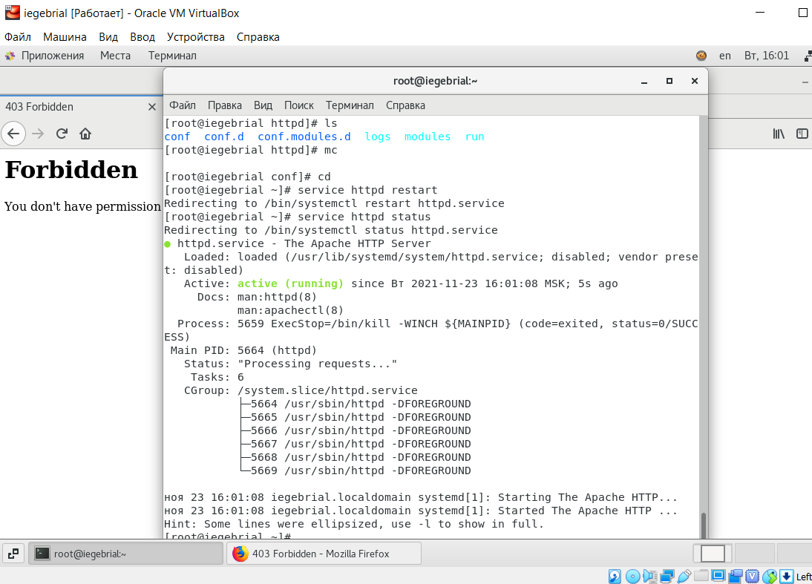{ #fig:018 width=70% }

17. Проанализировал лог-файлы: (рис. -@fig:019)

Мы можем видить что нет ошибок.

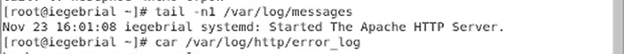{ #fig:019 width=70% }

18. Просмотел файлы /var/log/http/error_log, /var/log/http/access_log и /var/log/audit/audit.log  (рис. -@fig:020)(рис. -@fig:021)(рис. -@fig:022)

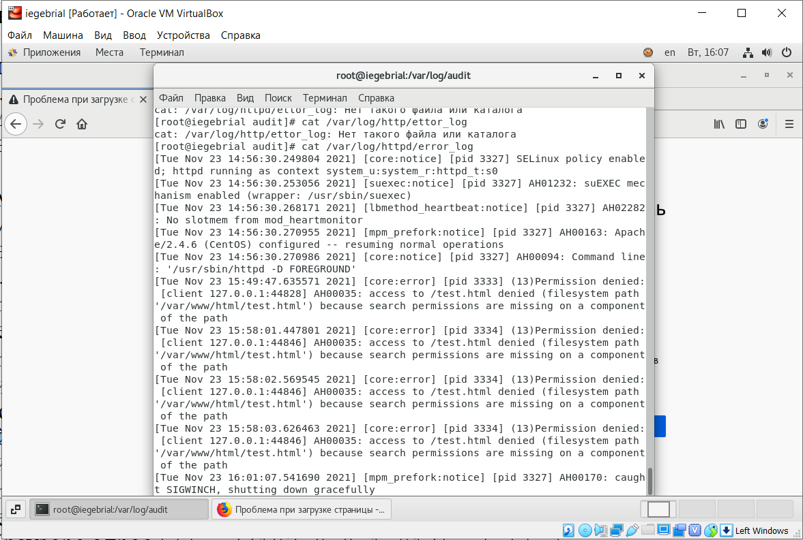{ #fig:020 width=70% }

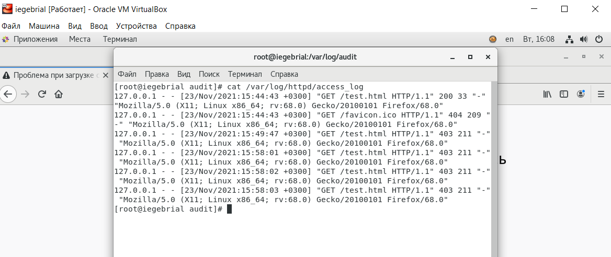{ #fig:021 width=70% }

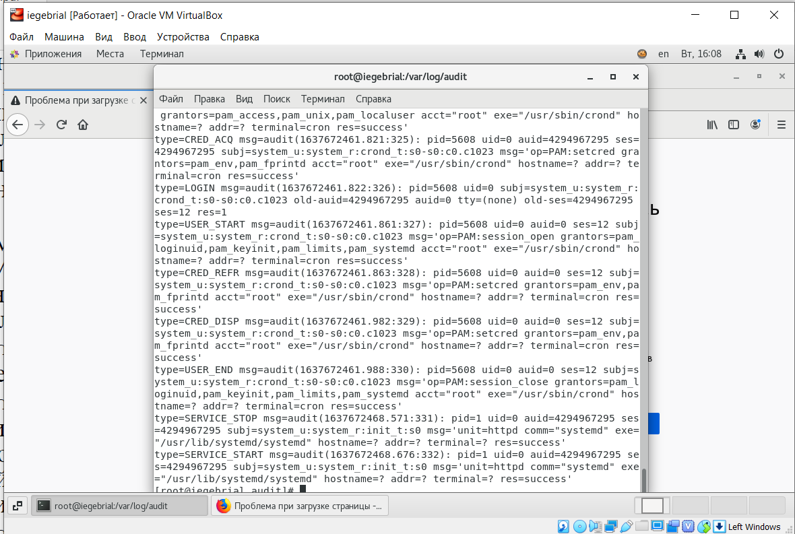{ #fig:022 width=70% }

19. Выполнил команду semanage port -a -t http_port_t -р tcp 81. После этого проверил список портов командой (рис. -@fig:023)

Убедился, что порт 81 появился в списке.

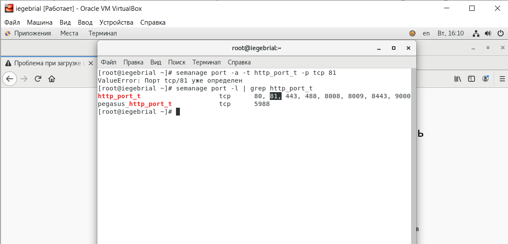{ #fig:023 width=70% }

20. Попробовал запустить веб-сервер Apache ещё раз. (рис. -@fig:024)

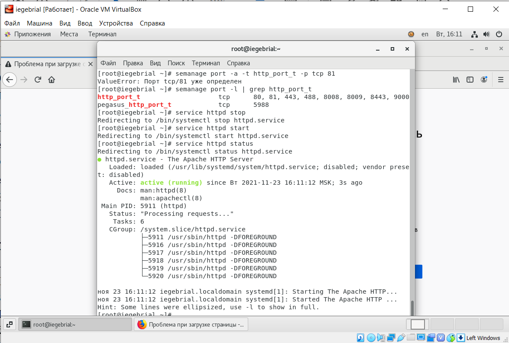{ #fig:024 width=70% }

21. Вернил контекст httpd_sys_cоntent__t к файлу /var/www/html/ test.html:(рис. -@fig:025)

chcon -t httpd_sys_content_t /var/www/html/test.html. 

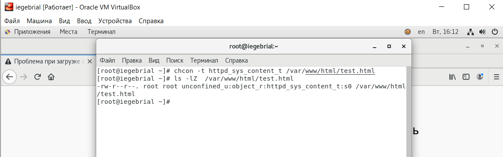{ #fig:025 width=70% }

22. Попробовал получить доступ к файлу через веб-сервер, введя в браузере адрес http://127.0.0.1:81/test.html. (рис. -@fig:026)

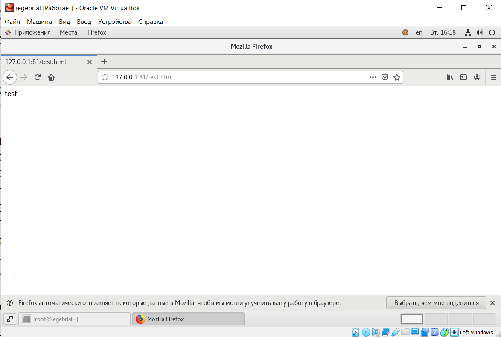{ #fig:026 width=70% }

23. Исправил обратно конфигурационный файл apache, вернув Listen 80. (рис. -@fig:027)

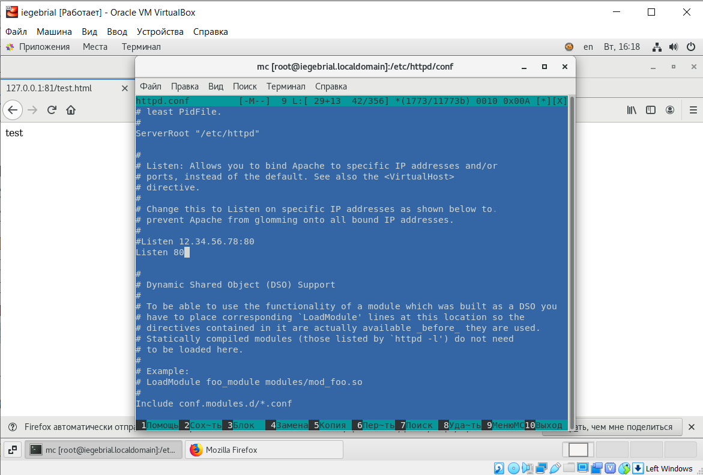{ #fig:027 width=70% }

24. Удалил привязку http_port_t к 81 порту и удалил файл /var/www/html/test.html. (рис. -@fig:028)

Не получилось удалить привязку так как он определен на уровне политики.

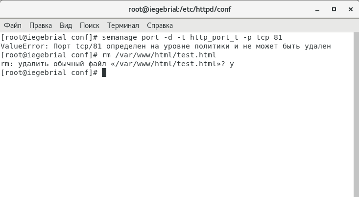{ #fig:028 width=70% }

# Выводы

Развил навыки администрирования ОС Linux. Получил первое практическое знакомство с технологией SELinux.
Проверил работу SELinx на практике совместно с веб-сервером Apache.

# Список литературы

1. Security-Enhanced Linux. Linux с улучшенной безопасностью: руководство пользователя / M. McAllister, S. Radvan, D. Walsh, D. Grift, E. Paris, J. Morris. — URL: https://docs-old.fedoraproject.org/ru-RU/Fedora/13/html/Security-Enhanced_Linux/index.html.

2. SELinux – описание и особенности работы с системой. Часть 1: автор / itNews. — URL: https://habr.com/ru/company/kingservers/blog/209644/. (дата обращения 20.01.2014). 